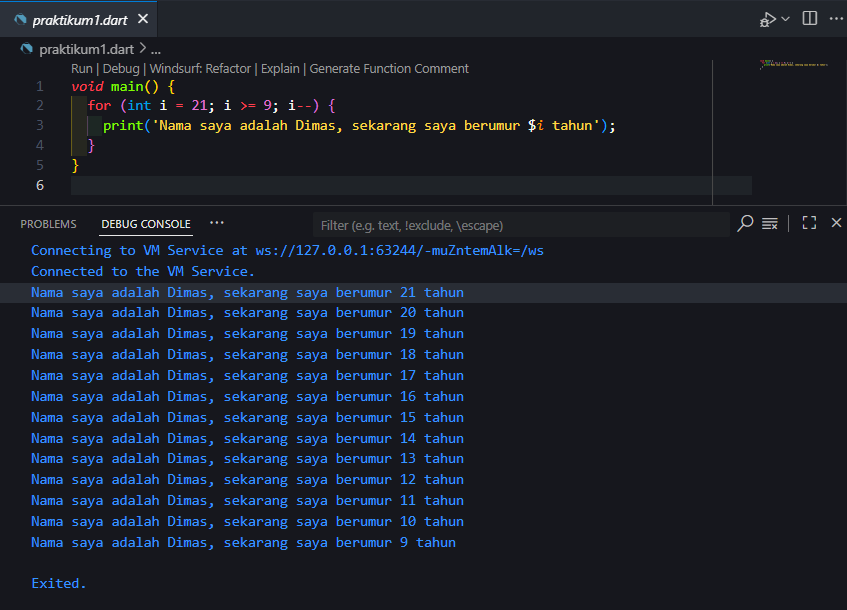
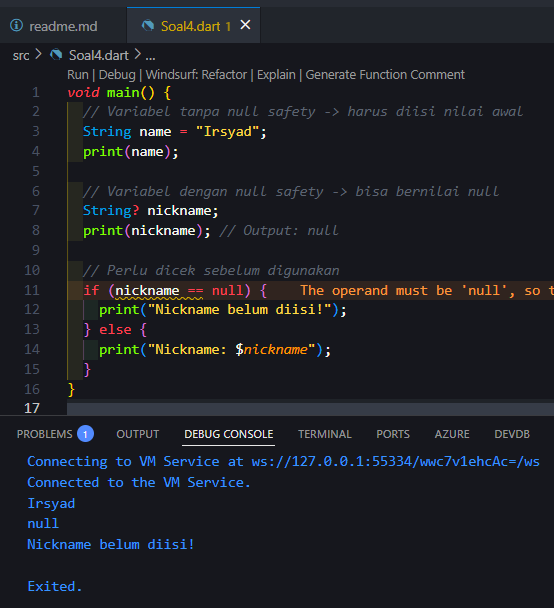

# <p align="center">LAPORAN PRAKTIKUM PEMROGRAMAN MOBILE</p>

<br><br>

<p align="center">
    
</p>

<br><br>

<p align="center">Nama  : Muhammad Irsyad Dimas Abdillah</p>
<p align="center">Absen : 20</p>
<p align="center">NIM   : 2341720088</p>
<p align="center">Prodi : TEKNIK INFORMATIKA</p>
<p align="center">Kelas : 3H</p>

---

# Soal 1

**Modifikasilah kode pada baris 3 di VS Code atau Editor Code favorit Anda berikut ini agar mendapatkan keluaran (output) sesuai yang diminta!**

### Kode Program
```dart
void main() {
    for (int i = 18; i >= 9; i--) {
        print('Nama saya adalah Muhammad Irsyad Dimas Abdillah, sekarang berumur $i');
    }
}
```
Output  


---

# Soal 2

**Mengapa sangat penting untuk memahami bahasa pemrograman Dart sebelum kita menggunakan framework Flutter? Jelaskan!**  
Jawab:  
a. Flutter diciptakan sepenuhnya dengan bahasa pemrograman Dart, sehingga semua kode, logika, dan struktur datanya menggunakan aturan Dart.  
b. Pemahaman Dart memudahkan kita untuk mengerti cara kerja widget, konsep OOP, serta fitur modern seperti Null Safety.  
c. Dengan menguasai Dart, kita bisa lebih cepat debugging, membangun struktur kode yang rapi, dan mengoptimalkan performa aplikasi.

**Sumber:**  
- Why Dart? — Flutter Official Docs  
- Dart Language Tour — dart.dev

---

# Soal 3

**Rangkumlah materi dari codelab ini menjadi poin-poin penting yang dapat Anda gunakan untuk membantu proses pengembangan aplikasi mobile menggunakan framework Flutter.**  
Jawab:  
1. **Peran & Sejarah**  
     - Dart adalah inti dari Flutter, digunakan untuk seluruh logika dan struktur aplikasi.  
     - Dikembangkan Google sejak 2011, semakin populer setelah dipakai di Flutter.  

2. **Keunggulan & Fitur Utama**  
     - **Produktivitas:** Mendukung *hot reload* dan integrasi IDE.  
     - **Kompilasi Fleksibel:**  
         - JIT untuk pengembangan (cepat & interaktif).  
         - AOT untuk rilis (cepat & optimal di perangkat).  
     - **Multi-Platform:** Bisa dijalankan di mobile, web, dan desktop.  
     - **Type Safety & Null Safety:** Menambah stabilitas dan mencegah error null.  
     - **Performa Tinggi:** Rendering cepat, dilengkapi *garbage collection*.  

3. **Struktur & Sintaks Dasar**  
     - Berbasis OOP: Semua adalah objek, mirip Java/C++.  
     - Fungsi `main()` sebagai entry point aplikasi.  
     - Mendukung async/await & isolate untuk pemrograman asinkron.  

4. **Memulai dengan Dart**  
     - **DartPad:** Media belajar online tanpa instalasi.  
     - **Pub:** Manajer paket resmi (pub.dev) dengan banyak library siap pakai.  

---

# Soal 4

**Buatlah penjelasan dan contoh eksekusi kode tentang perbedaan Null Safety dan Late variabel!**  
Jawab:  
- Null Safety adalah fitur Dart untuk mencegah error akibat penggunaan `null`.  
- Variabel **secara default tidak boleh bernilai `null`**, kecuali ditandai dengan `?`.  
- Jika variabel dideklarasikan tanpa `?`, maka harus langsung diberi nilai atau di-*initialize*.  

**Kode**
```dart
void main() {
  // Variabel tanpa null safety -> harus diisi nilai awal
  String name = "Irsyad";
  print(name);

  // Variabel dengan null safety -> bisa bernilai null
  String? nickname;
  print(nickname); // Output: null

  // Perlu dicek sebelum digunakan
  if (nickname == null) {
    print("Nickname belum diisi!");
  } else {
    print("Nickname: $nickname");
  }
}
```
**Output**  


