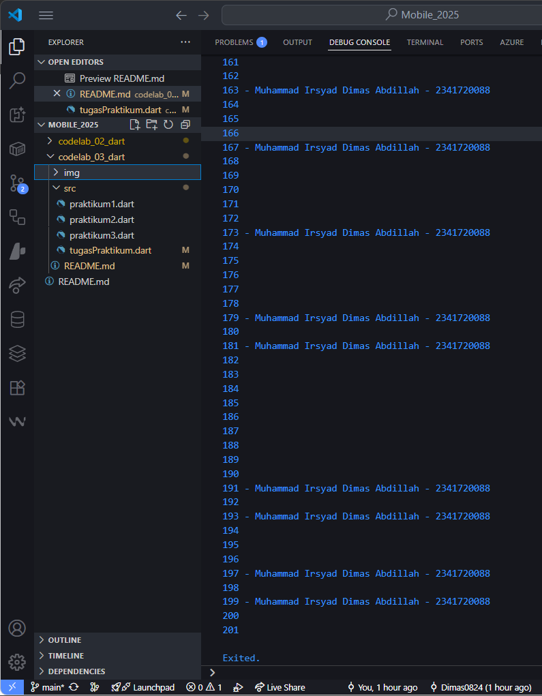

# <p align="center">LAPORAN PRAKTIKUM PEMROGRAMAN MOBILE</p>

<br><br>

<p align="center">
    
</p>

<br><br>

<p align="center">Nama  : Muhammad Irsyad Dimas Abdillah</p>
<p align="center">Absen : 20</p>
<p align="center">NIM   : 2341720088</p>
<p align="center">Prodi : TEKNIK INFORMATIKA</p>
<p align="center">Kelas : 3H</p>

---

# Praktikum 1

## Langkah 1:
Salin kode program berikut ke dalam fungsi main():

```dart
String test = "test2";
if (test == "test1") {
   print("Test1");
} else If (test == "test2") {
   print("Test2");
} Else {
   print("Something else");
}

if (test == "test2") print("Test2 again");
```

## Langkah 2
Silakan coba eksekusi (Run) kode pada langkah 1 tersebut. Apa yang terjadi? Jelaskan! <br>
jawab: 
  * variabel test akan bernilai "test2"
  * Kondisi pertama (if (test == "test1")) false, jadi dilewati.
  * Kondisi kedua (else if (test == "test2")) true, maka mencetak "Test2".
  * Bagian else tidak dijalankan karena salah satu kondisi sudah terpenuhi.
  * Kondisi terakhir (if (test == "test2") print("Test2 again");) juga true, sehingga mencetak "Test2 again".<br>
  
Output:  


## Langkah 3
Tambahkan kode program berikut, lalu coba eksekusi (Run) kode Anda. <br>

```dart
String test = "true";
if (test) {
   print("Kebenaran");
}
```
Output:
<br>

Dari output tersebut terlihat ada 2 error dimana:
   * Kode memunculkan error variable test sudah di definisikan sebelumnya atau sudah digunakan.
   * kedua kondisinya salah karena kode if hanya menerima static boolean, sedangkan dalam kode diatas test merupakan String.<br>
Dan ini merupakan perbaikan kode: <br>


# Praktikum 2
## Langkah 1
Ketik atau salin kode program berikut ke dalam fungsi main().

```dart
while (counter < 33) {
  print(counter);
  counter++;
}
```
## Langkah 2:
Silakan coba eksekusi (Run) kode pada langkah 1 tersebut. Apa yang terjadi? Jelaskan! Lalu perbaiki jika terjadi error. <br>
jawab: kode tersebut menghasilkan error undifined name counter, disebabkan karena variable counter belum ditambahkan ke kode.
Output setelah perbaikan: <br>

## Langkah 3
Tambahkan kode program berikut, lalu coba eksekusi (Run) kode Anda.

```dart
do {
  print(counter);
  counter++;
} while (counter < 77);
```

Apa yang terjadi ? Jika terjadi error, silakan perbaiki namun tetap menggunakan do-while.<br>
jawab: kode akan melanjutkan pencetakan angka hingga kondisi kedua yaitu < 77 <br>


# Praktikum 1
## Langkah 1
Ketik atau salin kode program berikut ke dalam fungsi main().
```dart
for (Index = 10; index < 27; index) {
  print(Index);
}
```
jawab: kode banyak mengalami error seperti undifined name Index, lalu ada ketidak konsistenan penggunaan variable pertama menggunakan Index, kedua menggunakan index. <br>


## Langkah 2
Silakan coba eksekusi (Run) kode pada langkah 1 tersebut. Apa yang terjadi? Jelaskan! Lalu perbaiki jika terjadi error.<br>
jawab: kode setelah diperbaiki akan menghasilkan output seperti pada foto dibawah ini


## Langkah 3
Tambahkan kode program berikut di dalam for-loop, lalu coba eksekusi (Run) kode Anda.
```dart
If (Index == 21) break;
Else If (index > 1 || index < 7) continue;
print(index);
```
Apa yang terjadi ? Jika terjadi error, silakan perbaiki namun tetap menggunakan for dan break-continue. <br>
jawab: kode tersebut akan menghasilkan error karena Else harus ditulis menggunakan huruf kecil else. 


# Tugas praktikum
1. Silakan selesaikan Praktikum 1 sampai 3, lalu dokumentasikan berupa screenshot hasil pekerjaan beserta penjelasannya!
2. Buatlah sebuah program yang dapat menampilkan bilangan prima dari angka 0 sampai 201 menggunakan Dart. Ketika bilangan prima ditemukan, maka tampilkan nama lengkap dan NIM Anda.
3. Kumpulkan berupa link commit repo GitHub pada tautan yang telah disediakan di grup Telegram!

```dart
void main() {
  String nama = "Muhammad Irsyad Dimas Abdillah";
  String nim = "2341720088";

  print("Bilangan Prima dari 0 sampai 201:");

  for (int number = 2; number <= 201; number++) {
    bool isPrime = true;

    // cek apakah number prima
    for (int i = 2; i * i <= number; i++) {
      if (number % i == 0) {
        isPrime = false;
        break;
      }
    }

    // jika prima, cetak beserta nama dan NIM
    if (isPrime) {
      print("$number - $nama - $nim");
    }
  }
}
```
Output kode: 