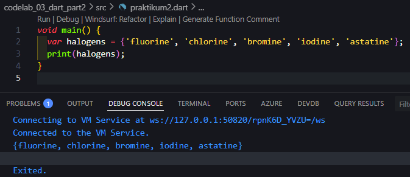
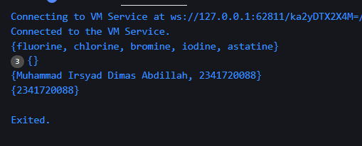
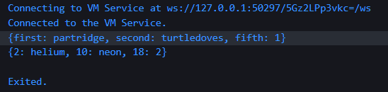

# <p align="center">LAPORAN PRAKTIKUM PEMROGRAMAN MOBILE</p>

<br><br>

<p align="center">
    
</p>

<br><br>

<p align="center">Nama  : Muhammad Irsyad Dimas Abdillah</p>
<p align="center">Absen : 20</p>
<p align="center">NIM   : 2341720088</p>
<p align="center">Prodi : TEKNIK INFORMATIKA</p>
<p align="center">Kelas : 3H</p>

---

# Praktikum 1: Eksperimen Tipe Data List
## Langkah 1:
Ketik atau salin kode program berikut ke dalam void main().
```dart
void main() {
  var list = [1, 2, 3];
  assert(list.length == 3);
  assert(list[1] == 2);
  print(list.length);
  print(list[1]);

  list[1] = 1;
  assert(list[1] == 1);
  print(list[1]);
}
```

## Langkah 2: 
Silakan coba eksekusi (Run) kode pada langkah 1 tersebut. Apa yang terjadi? Jelaskan!<br>
jawab: Program berjalan normal, dan menampilkan output di debug berupa angka 3,2,1. kode assert(list.length == 3); melakukan pengecekan panjang list yang di definisikan sebelumnya. kemudian kode mengecek elemen pada index ke 1 apakah bernilai 2 (benar). kemudian kode melakukan print, lalu merubah nilai dari index 1 menjadi 1 sebelumnya 2, dan melakukan print lagi. <br>


## Langkah 3:
Ubah kode pada langkah 1 menjadi variabel final yang mempunyai index = 5 dengan default value = null. Isilah nama dan NIM Anda pada elemen index ke-1 dan ke-2. Lalu print dan capture hasilnya.<br>


Apa yang terjadi ? Jika terjadi error, silakan perbaiki.<br>
jawab: Kode menunjukkan error bahwa a value of type string can't be assigned to a variable of type Null. Hal itu bisa terjadi karena kita membuat atau mendeklarasikan sebuah variable dengan final value null (type inference) sehingga saat diisikan dengan string maka akan error.<br>
Perbaikan dapat dilakukan dengan mengganti kode list menggunakan List<dynamic> untuk dinamis tipe data, atau List<string> hanya untuk menerima tipe data string. <br>
```dart
void main() {
  final list = List<string>.filled(5, '', growable: false);

  list[1] = "Muhammad Irsyad Dimas Abdillah";
  list[2] = "2341720088";

  print(list);
}
```
Sehingga outputnya seperti berikut ini:


# Praktikum 2: Eksperimen Tipe Data Set

## Langkah 1:
```dart
void main() {
  var halogens = {'fluorine', 'chlorine', 'bromine', 'iodine', 'astatine'};
  print(halogens);
}
```
## Langkah 2:
Silakan coba eksekusi (Run) kode pada langkah 1 tersebut. Apa yang terjadi? Jelaskan! Lalu perbaiki jika terjadi error.<br>
jawab: Tidak ada error yang terjadi, kode tersebut mendeklarasikan sebuah set bernama halogens berisikan 5 unsur halogen, kemudian kode melakukan print set tersebut. Set di Dart adalah kumpulan data yang tidak berurutan dan tidak memiliki elemen duplikat.

## Langkah 3:
```dart
void main() {
  var halogens = {'fluorine', 'chlorine', 'bromine', 'iodine', 'astatine'};
  print(halogens);

  var names1 = <String>{};
  Set<String> names2 = {}; // This works, too.
  var names3 = {}; // Creates a map, not a set.

  print(names1);
  print(names2);
  print(names3);

  // Tambahkan elemen nama dan nim ke dalam set
  names1.add('Muhammad Irsyad Dimas Abdillah');
  names2.add('2341720088');

  // Tambahkan elemen dengan method addAll()
  names1.addAll({'Muhammad Irsyad Dimas Abdillah', '2341720088'});

  print(names1);
  print(names2);
}
```
Apa yang terjadi ? Jika terjadi error, silakan perbaiki namun tetap menggunakan ketiga variabel tersebut. Tambahkan elemen nama dan NIM Anda pada kedua variabel Set tersebut dengan dua fungsi berbeda yaitu .add() dan .addAll(). Untuk variabel Map dihapus, nanti kita coba di praktikum selanjutnya.

jawab: kode tersebut membuat set, dan maps dan melakukan add elemen kedalam set tersebut melalui metode .add atau bisa menambahkan banyak elemen melalui metode .addAll.
dan terakhir names3 dihapus karena bukan set melainkan sebuah map kosong.



# Praktikum 3: Eksperimen Tipe Data Maps

## Langkah 1:
```dart
void main() {
  var gifts = {
    // Key:    Value
    'first': 'partridge',
    'second': 'turtledoves',
    'fifth': 1,
  };

  var nobleGases = {2: 'helium', 10: 'neon', 18: 2};

  print(gifts);
  print(nobleGases);
}

```
## Langkah 2:
Silakan coba eksekusi (Run) kode pada langkah 1 tersebut. Apa yang terjadi? Jelaskan! Lalu perbaiki jika terjadi error.

jawab: kode tidak mengalami error. Kode mendeklarasikan sebuah map di Dart dengan menyimpan data dalam bentuk pasangan antara key dan valuenya. Pada noblegases key berupa int dan valuenya string.


## Langkah 3:
Apa yang terjadi ? Jika terjadi error, silakan perbaiki.

Tambahkan elemen nama dan NIM Anda pada tiap variabel di atas (gifts, nobleGases, mhs1, dan mhs2). Dokumentasikan hasilnya dan buat laporannya!

# Praktikum 4: Eksperimen Tipe Data List: Spread dan Control-flow Operators

## Langkah 1:

## Langkah 2:

## Langkah 3:

## Langkah 4:

## Langkah 5:

## Langkah 6: