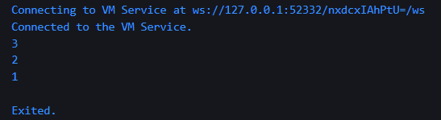
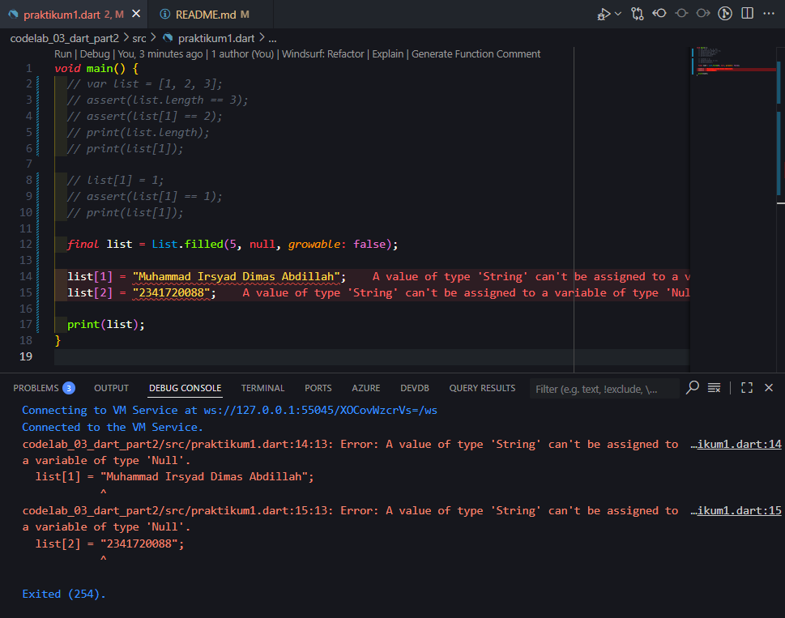
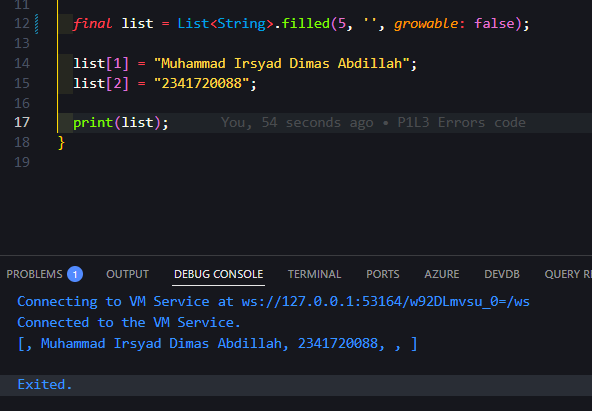

# <p align="center">LAPORAN PRAKTIKUM PEMROGRAMAN MOBILE</p>

<br><br>

<p align="center">
    
</p>

<br><br>

<p align="center">Nama  : Muhammad Irsyad Dimas Abdillah</p>
<p align="center">Absen : 20</p>
<p align="center">NIM   : 2341720088</p>
<p align="center">Prodi : TEKNIK INFORMATIKA</p>
<p align="center">Kelas : 3H</p>

---

# Praktikum 1: Eksperimen Tipe Data List
## Langkah 1:
Ketik atau salin kode program berikut ke dalam void main().
```dart
void main() {
  var list = [1, 2, 3];
  assert(list.length == 3);
  assert(list[1] == 2);
  print(list.length);
  print(list[1]);

  list[1] = 1;
  assert(list[1] == 1);
  print(list[1]);
}
```

## Langkah 2: 
Silakan coba eksekusi (Run) kode pada langkah 1 tersebut. Apa yang terjadi? Jelaskan!<br>
jawab: Program berjalan normal, dan menampilkan output di debug berupa angka 3,2,1. kode assert(list.length == 3); melakukan pengecekan panjang list yang di definisikan sebelumnya. kemudian kode mengecek elemen pada index ke 1 apakah bernilai 2 (benar). kemudian kode melakukan print, lalu merubah nilai dari index 1 menjadi 1 sebelumnya 2, dan melakukan print lagi. <br>


## Langkah 3:
Ubah kode pada langkah 1 menjadi variabel final yang mempunyai index = 5 dengan default value = null. Isilah nama dan NIM Anda pada elemen index ke-1 dan ke-2. Lalu print dan capture hasilnya.<br>


Apa yang terjadi ? Jika terjadi error, silakan perbaiki.<br>
jawab: Kode menunjukkan error bahwa a value of type string can't be assigned to a variable of type Null. Hal itu bisa terjadi karena kita membuat atau mendeklarasikan sebuah variable dengan final value null (type inference) sehingga saat diisikan dengan string maka akan error.<br>
Perbaikan dapat dilakukan dengan mengganti kode list menggunakan List<dynamic> untuk dinamis tipe data, atau List<string> hanya untuk menerima tipe data string. <br>
```dart
void main() {
  final list = List<string>.filled(5, '', growable: false);

  list[1] = "Muhammad Irsyad Dimas Abdillah";
  list[2] = "2341720088";

  print(list);
}
```
Sehingga outputnya seperti berikut ini:

