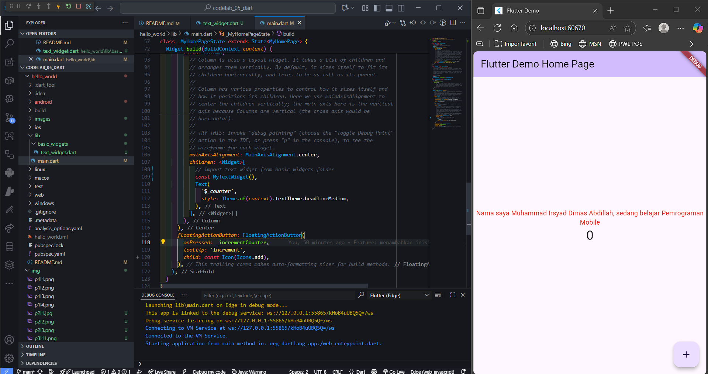

# <p align="center">LAPORAN PRAKTIKUM PEMROGRAMAN MOBILE</p>

<br>

<p align="center">
    
</p>

<br>

<table align="center">
    <tr>
        <td><strong>Nama</strong></td>
        <td>: Muhammad Irsyad Dimas Abdillah</td>
    </tr>
    <tr>
        <td><strong>Absen</strong></td>
        <td>: 20</td>
    </tr>
    <tr>
        <td><strong>NIM</strong></td>
        <td>: 2341720088</td>
    </tr>
    <tr>
        <td><strong>Prodi</strong></td>
        <td>: TEKNIK INFORMATIKA</td>
    </tr>
    <tr>
        <td><strong>Kelas</strong></td>
        <td>: 3H</td>
    </tr>
</table>

---

## Praktikum 1: Membuat Project Flutter Baru

### Langkah 1
Buka VS Code, tekan <kbd>Ctrl</kbd> + <kbd>Shift</kbd> + <kbd>P</kbd> untuk membuka Command Palette, lalu ketik `Flutter`. Pilih **New Application Project**. <br>


> **Catatan:** Command Palette juga dapat diakses melalui menu **View > Command Palette**. Shortcut <kbd>Ctrl</kbd> + <kbd>Shift</kbd> + <kbd>P</kbd> berlaku di Windows.

### Langkah 2
Buat folder sesuai style laporan praktikum yang Anda pilih. Disarankan di folder dokumen, desktop, atau lokasi lain yang tidak terlalu dalam. Pilih folder tersebut untuk membuat project.<br>


### Langkah 3
Buat nama project Flutter `hello_world` (huruf kecil, tanpa spasi, gunakan underscore jika perlu). Tekan Enter dan tunggu proses selesai. <br>


> **Perhatian:** Nama project harus lowercase, tanpa spasi, tidak diawali angka/karakter khusus. Nama ini bukan nama aplikasi di Play Store/App Store.

### Langkah 4
Pastikan muncul pesan "Your Flutter Project is ready!" menandakan project berhasil dibuat. <br>


---

## Praktikum 2: Menghubungkan Perangkat Android atau Emulator

Melanjutkan dari praktikum 1, jalankan aplikasi ke perangkat fisik (Android/iOS) sesuai langkah pada codelab terkait.

### Langkah 1

Mengaktifkan USB debugging di HP


### Langkah 2

Download USB Driver untuk debugging


### Langkah 3

Cek apakah HP sudah terkoneksi di Android Studio. Untuk case saya terlihat HP dengan registrasi nama: Xiaomi 21061110AG, Android 13 (Tiramisu) sudah terkoneksi. 


---

## Praktikum 3: Membuat Repository GitHub dan Laporan Praktikum
> **Asumsi** bahwa sudah memiliki akun dan repositori github:

### Langkah 11
Di VS Code, ubah platform ke emulator/device atau browser Chrome. Jalankan project dengan <kbd>F5</kbd> atau **Run > Start Debugging**.


> **Catatan:** Kompilasi pertama kali memakan waktu 3-5 menit, selanjutnya lebih cepat.

### Langkah 12
Screenshot aplikasi pada Langkah 11 dengan nama lengkap Anda. Simpan screenshot sebagai `01.png` di folder `images` (buat folder jika belum ada). Ubah isi `README.md` untuk menampilkan screenshot, lalu push ke repository.


> **Perhatian:** Lakukan screenshot seperti Langkah 12 untuk setiap laporan praktikum berikutnya hingga project final.

## Praktikum 4: Menerapkan Widget Dasar

### Langkah 1: Text Widget

Buat folder baru `basic_widgets` di dalam folder `lib`. Kemudian buat file baru di dalam `basic_widgets` dengan nama `text_widget.dart`. Salin kode berikut ke file tersebut, dan ganti teks "Fulan" dengan nama lengkap Anda:

```dart
import 'package:flutter/material.dart';

class MyTextWidget extends StatelessWidget {
    const MyTextWidget({Key? key}) : super(key: key);

    @override
    Widget build(BuildContext context) {
        return const Text(
            "Nama saya Muhammad Irsyad Dimas Abdillah, sedang belajar Pemrograman Mobile",
            style: TextStyle(color: Colors.red, fontSize: 14),
            textAlign: TextAlign.center,
        );
    }
}
```


Import file `text_widget.dart` ke `main.dart`, lalu ganti bagian text widget dengan kode di atas. Hasilnya akan seperti gambar berikut:



---

### Langkah 2: Image Widget

Buat file baru `image_widget.dart` di dalam folder `basic_widgets` dengan isi kode berikut:

```dart
import 'package:flutter/material.dart';

class MyImageWidget extends StatelessWidget {
    const MyImageWidget({Key? key}) : super(key: key);

    @override
    Widget build(BuildContext context) {
        return const Image(
            image: AssetImage("logo_polinema.jpg"),
        );
    }
}
```

Tambahkan file logo Anda (`logo_polinema.jpg`) ke folder `assets` di project `hello_world`. Sesuaikan pengaturan asset pada file `pubspec.yaml`:

```yaml
flutter:
    assets:
        - logo_polinema.jpg
```

Import dan gunakan widget ini di `main.dart`. Hasilnya akan tampil seperti gambar berikut:


