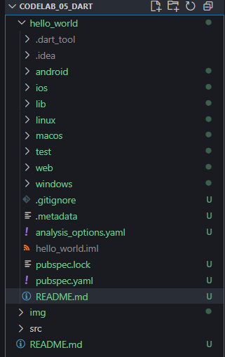
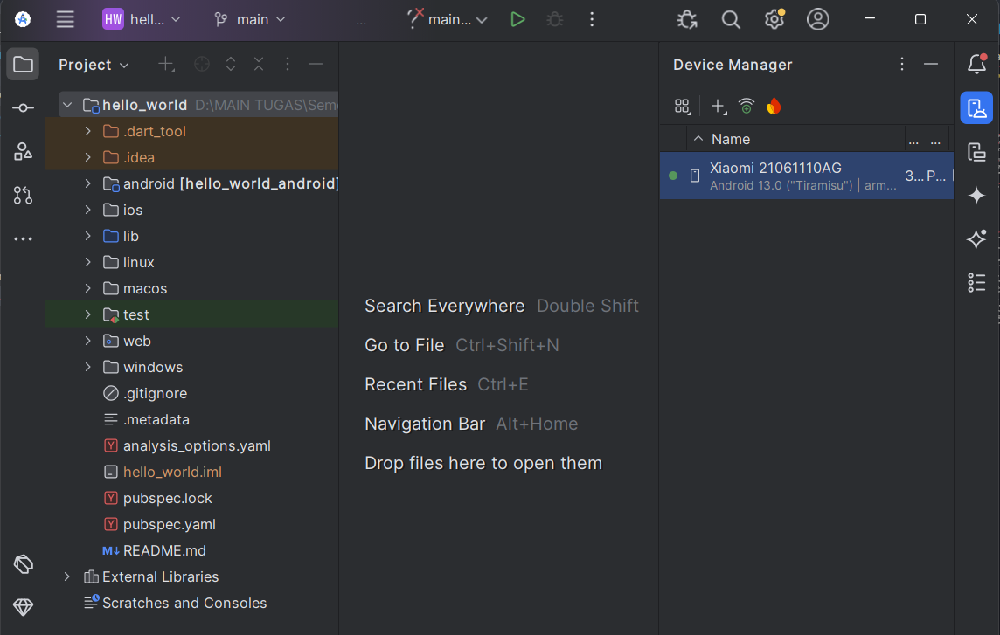

# <p align="center">LAPORAN PRAKTIKUM PEMROGRAMAN MOBILE</p>

<br>

<p align="center">
    
</p>

<br>

<table align="center">
    <tr>
        <td><strong>Nama</strong></td>
        <td>: Muhammad Irsyad Dimas Abdillah</td>
    </tr>
    <tr>
        <td><strong>Absen</strong></td>
        <td>: 20</td>
    </tr>
    <tr>
        <td><strong>NIM</strong></td>
        <td>: 2341720088</td>
    </tr>
    <tr>
        <td><strong>Prodi</strong></td>
        <td>: TEKNIK INFORMATIKA</td>
    </tr>
    <tr>
        <td><strong>Kelas</strong></td>
        <td>: 3H</td>
    </tr>
</table>

---

## Praktikum 1: Membuat Project Flutter Baru

### Langkah 1
Buka VS Code, tekan <kbd>Ctrl</kbd> + <kbd>Shift</kbd> + <kbd>P</kbd> untuk membuka Command Palette, lalu ketik `Flutter`. Pilih **New Application Project**. <br>


> **Catatan:** Command Palette juga dapat diakses melalui menu **View > Command Palette**. Shortcut <kbd>Ctrl</kbd> + <kbd>Shift</kbd> + <kbd>P</kbd> berlaku di Windows.

### Langkah 2
Buat folder sesuai style laporan praktikum yang Anda pilih. Disarankan di folder dokumen, desktop, atau lokasi lain yang tidak terlalu dalam. Pilih folder tersebut untuk membuat project.<br>


### Langkah 3
Buat nama project Flutter `hello_world` (huruf kecil, tanpa spasi, gunakan underscore jika perlu). Tekan Enter dan tunggu proses selesai. <br>


> **Perhatian:** Nama project harus lowercase, tanpa spasi, tidak diawali angka/karakter khusus. Nama ini bukan nama aplikasi di Play Store/App Store.

### Langkah 4
Pastikan muncul pesan "Your Flutter Project is ready!" menandakan project berhasil dibuat. <br>


---

## Praktikum 2: Menghubungkan Perangkat Android atau Emulator

Melanjutkan dari praktikum 1, jalankan aplikasi ke perangkat fisik (Android/iOS) sesuai langkah pada codelab terkait.

### Langkah 1

Mengaktifkan USB debugging di HP


### Langkah 2

Download USB Driver untuk debugging


### Langkah 3

Cek apakah HP sudah terkoneksi di Android Studio. Untuk case saya terlihat HP dengan registrasi nama: Xiaomi 21061110AG, Android 13 (Tiramisu) sudah terkoneksi. 



---

## Praktikum 3: Membuat Repository GitHub dan Laporan Praktikum
> **Asumsi** bahwa sudah memiliki akun dan repositori github:

### Langkah 11
Di VS Code, ubah platform ke emulator/device atau browser Chrome. Jalankan project dengan <kbd>F5</kbd> atau **Run > Start Debugging**.


> **Catatan:** Kompilasi pertama kali memakan waktu 3-5 menit, selanjutnya lebih cepat.

### Langkah 12
Screenshot aplikasi pada Langkah 11 dengan nama lengkap Anda. Simpan screenshot sebagai `01.png` di folder `images` (buat folder jika belum ada). Ubah isi `README.md` untuk menampilkan screenshot, lalu push ke repository.


> **Perhatian:** Lakukan screenshot seperti Langkah 12 untuk setiap laporan praktikum berikutnya hingga project final.

## Praktikum 4: Menerapkan Widget Dasar

### Langkah 1: Text Widget

Buat folder baru `basic_widgets` di dalam folder `lib`. Kemudian buat file baru di dalam `basic_widgets` dengan nama `text_widget.dart`. Salin kode berikut ke file tersebut, dan ganti teks "Fulan" dengan nama lengkap Anda:

```dart
import 'package:flutter/material.dart';

class MyTextWidget extends StatelessWidget {
    const MyTextWidget({Key? key}) : super(key: key);

    @override
    Widget build(BuildContext context) {
        return const Text(
            "Nama saya Muhammad Irsyad Dimas Abdillah, sedang belajar Pemrograman Mobile",
            style: TextStyle(color: Colors.red, fontSize: 14),
            textAlign: TextAlign.center,
        );
    }
}
```


Import file `text_widget.dart` ke `main.dart`, lalu ganti bagian text widget dengan kode di atas. Hasilnya akan seperti gambar berikut:


---

### Langkah 2: Image Widget

Buat file baru `image_widget.dart` di dalam folder `basic_widgets` dengan isi kode berikut:

```dart
import 'package:flutter/material.dart';

class MyImageWidget extends StatelessWidget {
    const MyImageWidget({Key? key}) : super(key: key);

    @override
    Widget build(BuildContext context) {
        return const Image(
            image: AssetImage("logo_polinema.jpg"),
        );
    }
}
```


Tambahkan file logo Anda (`logo_polinema.jpg`) ke folder `assets` di project `hello_world`. Sesuaikan pengaturan asset pada file `pubspec.yaml`:

```yaml
flutter:
    assets:
        - logo_polinema.jpg
```


Import dan gunakan widget ini di `main.dart`. Hasilnya akan tampil seperti gambar berikut:


## Praktikum 5: Menerapkan Widget Material Design dan iOS Cupertino

Selesaikan langkah-langkah praktikum berikut ini dengan melanjutkan project `hello_world` Anda. Lakukan langkah yang sama seperti pada Praktikum 3, yaitu setiap widget dibuat file sendiri lalu import ke `main.dart` dan screenshot hasilnya.

### Langkah 1: Cupertino Button dan Loading Bar

Buat file di `basic_widgets/loading_cupertino.dart`. Import stateless widget dari material dan cupertino. Isi kode di dalam method `Widget build` adalah sebagai berikut:

```dart
return MaterialApp(
    home: Container(
        margin: const EdgeInsets.only(top: 30),
        color: Colors.white,
        child: Column(
            children: <Widget>[
                CupertinoButton(
                    child: const Text("Contoh button"),
                    onPressed: () {},
                ),
                const CupertinoActivityIndicator(),
            ],
        ),
    ),
);
```


### Langkah 2: Floating Action Button (FAB)

Buat file di `basic_widgets/fab_widget.dart`. Import stateless widget dari material. Isi kode di dalam method `Widget build` adalah sebagai berikut:

```dart
return MaterialApp(
    home: Scaffold(
        floatingActionButton: FloatingActionButton(
            onPressed: () {
                // Add your onPressed code here!
            },
            child: const Icon(Icons.thumb_up),
            backgroundColor: Colors.pink,
        ),
    ),
);
```


### Langkah 3: Scaffold Widget

Scaffold widget digunakan untuk mengatur tata letak sesuai dengan material design. Ubah isi kode `main.dart` seperti berikut:

```dart
import 'package:flutter/material.dart';

void main() {
    runApp(const MyApp());
}

class MyApp extends StatelessWidget {
    const MyApp({Key? key}) : super(key: key);

    @override
    Widget build(BuildContext context) {
        return MaterialApp(
            title: 'Flutter Demo',
            theme: ThemeData(
                primarySwatch: Colors.red,
            ),
            home: const MyHomePage(title: 'My Increment App'),
        );
    }
}

class MyHomePage extends StatefulWidget {
    const MyHomePage({Key? key, required this.title}) : super(key: key);

    final String title;

    @override
    State<MyHomePage> createState() => _MyHomePageState();
}

class _MyHomePageState extends State<MyHomePage> {
    int _counter = 0;

    void _incrementCounter() {
        setState(() {
            _counter++;
        });
    }

    @override
    Widget build(BuildContext context) {
        return Scaffold(
            appBar: AppBar(
                title: Text(widget.title),
            ),
            body: Center(
                child: Column(
                    mainAxisAlignment: MainAxisAlignment.center,
                    children: <Widget>[
                        const Text(
                            'You have pushed the button this many times:',
                        ),
                        Text(
                            '$_counter',
                            style: Theme.of(context).textTheme.headline4,
                        ),
                    ],
                ),
            ),
            bottomNavigationBar: BottomAppBar(
                child: Container(
                    height: 50.0,
                ),
            ),
            floatingActionButton: FloatingActionButton(
                onPressed: _incrementCounter,
                tooltip: 'Increment Counter',
                child: const Icon(Icons.add),
            ),
            floatingActionButtonLocation: FloatingActionButtonLocation.centerDocked,
        );
    }
}
```


### Langkah 4: Dialog Widget

Dialog widget pada flutter memiliki dua jenis dialog yaitu `AlertDialog` dan `SimpleDialog`. Ubah isi kode `main.dart` seperti berikut:

```dart
class MyApp extends StatelessWidget {
    const MyApp({Key? key}) : super(key: key);

    @override
    Widget build(BuildContext context) {
        return const MaterialApp(
            home: Scaffold(
                body: MyLayout(),
            ),
        );
    }
}

class MyLayout extends StatelessWidget {
    const MyLayout({Key? key}) : super(key: key);

    @override
    Widget build(BuildContext context) {
        return Padding(
            padding: const EdgeInsets.all(8.0),
            child: ElevatedButton(
                child: const Text('Show alert'),
                onPressed: () {
                    showAlertDialog(context);
                },
            ),
        );
    }
}

showAlertDialog(BuildContext context) {
    Widget okButton = TextButton(
        child: const Text("OK"),
        onPressed: () {
            Navigator.pop(context);
        },
    );

    AlertDialog alert = AlertDialog(
        title: const Text("My title"),
        content: const Text("This is my message."),
        actions: [
            okButton,
        ],
    );

    showDialog(
        context: context,
        builder: (BuildContext context) {
            return alert;
        },
    );
}
```


### Langkah 5: Input dan Selection Widget

Flutter menyediakan widget yang dapat menerima input dari pengguna aplikasi seperti Checkbox, Date and Time Pickers, Radio Button, Slider, Switch, TextField.

Contoh penggunaan `TextField` widget:

```dart
class MyApp extends StatelessWidget {
    const MyApp({Key? key}) : super(key: key);

    @override
    Widget build(BuildContext context) {
        return MaterialApp(
            home: Scaffold(
                appBar: AppBar(title: const Text("Contoh TextField")),
                body: const TextField(
                    obscureText: false,
                    decoration: InputDecoration(
                        border: OutlineInputBorder(),
                        labelText: 'Nama',
                    ),
                ),
            ),
        );
    }
}
```


### Langkah 6: Date and Time Pickers

Date and Time Pickers termasuk pada kategori input dan selection widget. Berikut contoh penggunaan Date and Time Pickers:

```dart
import 'dart:async';
import 'package:flutter/material.dart';

void main() => runApp(const MyApp());

class MyApp extends StatelessWidget {
    const MyApp({Key? key}) : super(key: key);

    @override
    Widget build(BuildContext context) {
        return const MaterialApp(
            title: 'Contoh Date Picker',
            home: MyHomePage(title: 'Contoh Date Picker'),
        );
    }
}

class MyHomePage extends StatefulWidget {
    const MyHomePage({Key? key, required this.title}) : super(key: key);

    final String title;

    @override
    _MyHomePageState createState() => _MyHomePageState();
}

class _MyHomePageState extends State<MyHomePage> {
    DateTime selectedDate = DateTime.now();

    Future<void> _selectDate(BuildContext context) async {
        final DateTime? picked = await showDatePicker(
                context: context,
                initialDate: selectedDate,
                firstDate: DateTime(2015, 8),
                lastDate: DateTime(2101));
        if (picked != null && picked != selectedDate) {
            setState(() {
                selectedDate = picked;
            });
        }
    }

    @override
    Widget build(BuildContext context) {
        return Scaffold(
            appBar: AppBar(
                title: Text(widget.title),
            ),
            body: Center(
                child: Column(
                    mainAxisSize: MainAxisSize.min,
                    children: <Widget>[
                        Text("${selectedDate.toLocal()}".split(' ')[0]),
                        const SizedBox(
                            height: 20.0,
                        ),
                        ElevatedButton(
                            onPressed: () => {
                                _selectDate(context),
                                print(selectedDate.day + selectedDate.month + selectedDate.year)
                            },
                            child: const Text('Pilih Tanggal'),
                        ),
                    ],
                ),
            ),
        );
    }
}
```


