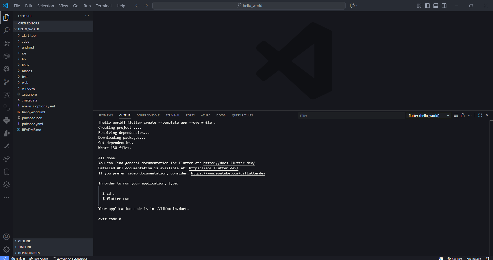

# <p align="center">LAPORAN PRAKTIKUM PEMROGRAMAN MOBILE</p>

<br>

<p align="center">
    
</p>

<br>

<table align="center">
    <tr>
        <td><strong>Nama</strong></td>
        <td>: Muhammad Irsyad Dimas Abdillah</td>
    </tr>
    <tr>
        <td><strong>Absen</strong></td>
        <td>: 20</td>
    </tr>
    <tr>
        <td><strong>NIM</strong></td>
        <td>: 2341720088</td>
    </tr>
    <tr>
        <td><strong>Prodi</strong></td>
        <td>: TEKNIK INFORMATIKA</td>
    </tr>
    <tr>
        <td><strong>Kelas</strong></td>
        <td>: 3H</td>
    </tr>
</table>

---

## Praktikum 1: Membuat Project Flutter Baru

### Langkah 1
Buka VS Code, tekan <kbd>Ctrl</kbd> + <kbd>Shift</kbd> + <kbd>P</kbd> untuk membuka Command Palette, lalu ketik `Flutter`. Pilih **New Application Project**. <br>


> **Catatan:** Command Palette juga dapat diakses melalui menu **View > Command Palette**. Shortcut <kbd>Ctrl</kbd> + <kbd>Shift</kbd> + <kbd>P</kbd> berlaku di Windows.

### Langkah 2
Buat folder sesuai style laporan praktikum yang Anda pilih. Disarankan di folder dokumen, desktop, atau lokasi lain yang tidak terlalu dalam. Pilih folder tersebut untuk membuat project.<br>


### Langkah 3
Buat nama project Flutter `hello_world` (huruf kecil, tanpa spasi, gunakan underscore jika perlu). Tekan Enter dan tunggu proses selesai. <br>


> **Perhatian:** Nama project harus lowercase, tanpa spasi, tidak diawali angka/karakter khusus. Nama ini bukan nama aplikasi di Play Store/App Store.

### Langkah 4
Pastikan muncul pesan "Your Flutter Project is ready!" menandakan project berhasil dibuat. <br>


---

## Praktikum 2: Menghubungkan Perangkat Android atau Emulator

Melanjutkan dari praktikum 1, jalankan aplikasi ke perangkat fisik (Android/iOS) sesuai langkah pada codelab terkait.

---

## Praktikum 3: Membuat Repository GitHub dan Laporan Praktikum

### Langkah 1
Login ke GitHub, buat repository baru bernama `flutter-fundamental-part1`.

### Langkah 2
Klik **Create repository**.

### Langkah 3
Buka VS Code pada project `hello_world`, buka terminal (**Terminal > New Terminal**) dan jalankan:
```bash
git init
```

### Langkah 4
Pilih menu **Source Control**, lakukan stage (+) pada file `.gitignore`.

### Langkah 5
Commit dengan pesan "tambah gitignore", lalu klik **Commit** (✔).

### Langkah 6
Push dengan klik menu titik tiga > **Push**.

### Langkah 7
Klik **Add Remote** pada notifikasi di pojok kanan bawah.

### Langkah 8
Salin tautan repository dari browser, klik **Add remote**, beri nama `origin`.

### Langkah 9
Stage dan push file `README.md`. Masukkan username dan personal access token GitHub saat push. Reload halaman repository untuk melihat hasil.

> **Perhatian:** Personal access token dapat dibuat di [GitHub Token Settings](https://github.com/settings/tokens/new).

### Langkah 10
Push semua file lain dengan **Stage All Changes**. Commit dengan pesan "project hello_world" dan push ke repository.

### Langkah 11
Di VS Code, ubah platform ke emulator/device atau browser Chrome. Jalankan project dengan <kbd>F5</kbd> atau **Run > Start Debugging**.

> **Catatan:** Kompilasi pertama kali memakan waktu 3-5 menit, selanjutnya lebih cepat.

### Langkah 12
Screenshot aplikasi pada Langkah 11 dengan nama lengkap Anda. Simpan screenshot sebagai `01.png` di folder `images` (buat folder jika belum ada). Ubah isi `README.md` untuk menampilkan screenshot, lalu push ke repository.

> **Perhatian:** Lakukan screenshot seperti Langkah 12 untuk setiap laporan praktikum berikutnya hingga project final.

