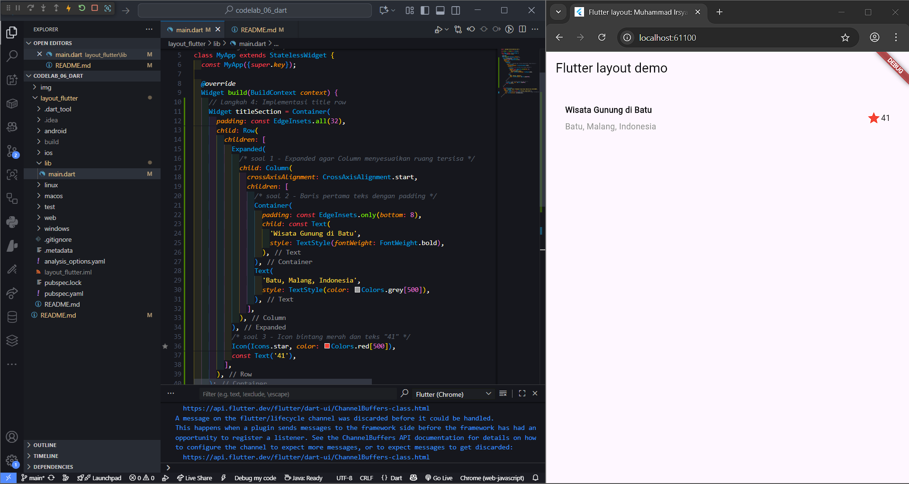
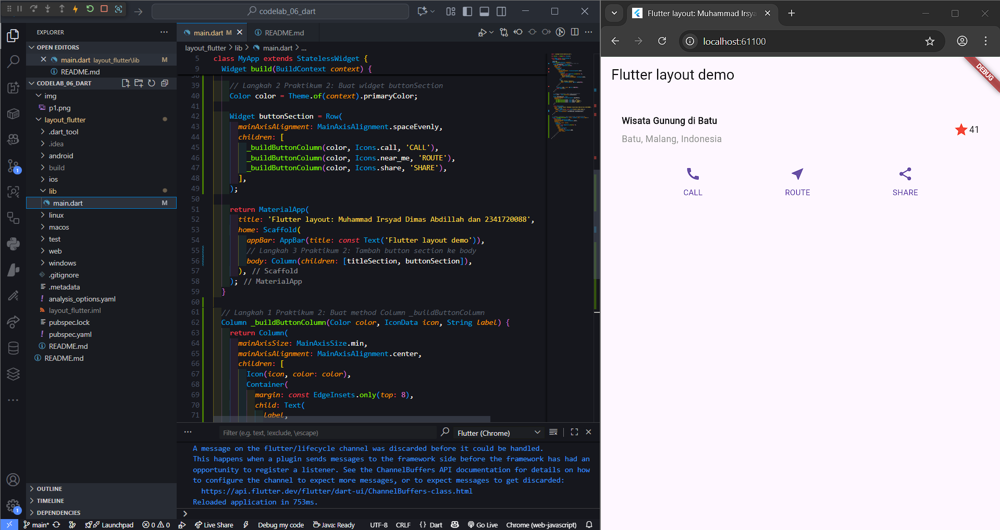

# <p align="center">LAPORAN PRAKTIKUM PEMROGRAMAN MOBILE</p>

<br>

<p align="center">
    
</p>

<br>

<table align="center">
    <tr>
        <td><strong>Nama</strong></td>
        <td>: Muhammad Irsyad Dimas Abdillah</td>
    </tr>
    <tr>
        <td><strong>Absen</strong></td>
        <td>: 20</td>
    </tr>
    <tr>
        <td><strong>NIM</strong></td>
        <td>: 2341720088</td>
    </tr>
    <tr>
        <td><strong>Prodi</strong></td>
        <td>: TEKNIK INFORMATIKA</td>
    </tr>
    <tr>
        <td><strong>Kelas</strong></td>
        <td>: 3H</td>
    </tr>
</table>

---

## Praktikum 1: Membangun Layout di Flutter

### Code:
```dart
import 'package:flutter/material.dart';

void main() => runApp(const MyApp());

class MyApp extends StatelessWidget {
  const MyApp({super.key});

  @override
  Widget build(BuildContext context) {
    // Langkah 4: Implementasi title row
    Widget titleSection = Container(
      padding: const EdgeInsets.all(32),
      child: Row(
        children: [
          Expanded(
            /* soal 1 - Expanded agar Column menyesuaikan ruang tersisa */
            child: Column(
              crossAxisAlignment: CrossAxisAlignment.start,
              children: [
                /* soal 2 - Baris pertama teks dengan padding */
                Container(
                  padding: const EdgeInsets.only(bottom: 8),
                  child: const Text(
                    'Wisata Gunung di Batu',
                    style: TextStyle(fontWeight: FontWeight.bold),
                  ),
                ),
                Text(
                  'Batu, Malang, Indonesia',
                  style: TextStyle(color: Colors.grey[500]),
                ),
              ],
            ),
          ),
          /* soal 3 - Icon bintang merah dan teks "41" */
          Icon(Icons.star, color: Colors.red[500]),
          const Text('41'),
        ],
      ),
    );
    
    return MaterialApp(
      title: 'Flutter layout: Muhammad Irsyad Dimas Abdillah dan 2341720088',
      home: Scaffold(
        appBar: AppBar(title: const Text('Flutter layout demo')),
        // Ganti body dari Center(child: Text('Hello World')) dengan titleSection
        body: Column(children: [titleSection]),
      ),
    );
  }
}
```
### Screenshot:


## Praktikum 2: Implementasi button row
### Code:
```dart
import 'package:flutter/material.dart';

void main() => runApp(const MyApp());

class MyApp extends StatelessWidget {
  const MyApp({super.key});

  @override
  Widget build(BuildContext context) {
    // Langkah 4 Praktikum 1: Implementasi title row
    Widget titleSection = Container(
      padding: const EdgeInsets.all(32),
      child: Row(
        children: [
          Expanded(
            child: Column(
              crossAxisAlignment: CrossAxisAlignment.start,
              children: [
                Container(
                  padding: const EdgeInsets.only(bottom: 8),
                  child: const Text(
                    'Wisata Gunung di Batu',
                    style: TextStyle(fontWeight: FontWeight.bold),
                  ),
                ),
                Text(
                  'Batu, Malang, Indonesia',
                  style: TextStyle(color: Colors.grey[500]),
                ),
              ],
            ),
          ),
          Icon(Icons.star, color: Colors.red[500]),
          const Text('41'),
        ],
      ),
    );

    // Langkah 2 Praktikum 2: Buat widget buttonSection
    Color color = Theme.of(context).primaryColor;

    Widget buttonSection = Row(
      mainAxisAlignment: MainAxisAlignment.spaceEvenly,
      children: [
        _buildButtonColumn(color, Icons.call, 'CALL'),
        _buildButtonColumn(color, Icons.near_me, 'ROUTE'),
        _buildButtonColumn(color, Icons.share, 'SHARE'),
      ],
    );

    return MaterialApp(
      title: 'Flutter layout: Muhammad Irsyad Dimas Abdillah dan 2341720088',
      home: Scaffold(
        appBar: AppBar(title: const Text('Flutter layout demo')),
        // Langkah 3 Praktikum 2: Tambah button section ke body
        body: Column(children: [titleSection, buttonSection]),
      ),
    );
  }

  // Langkah 1 Praktikum 2: Buat method Column _buildButtonColumn
  Column _buildButtonColumn(Color color, IconData icon, String label) {
    return Column(
      mainAxisSize: MainAxisSize.min,
      mainAxisAlignment: MainAxisAlignment.center,
      children: [
        Icon(icon, color: color),
        Container(
          margin: const EdgeInsets.only(top: 8),
          child: Text(
            label,
            style: TextStyle(
              fontSize: 12,
              fontWeight: FontWeight.w400,
              color: color,
            ),
          ),
        ),
      ],
    );
  }
}
```
### Screenshot:


## Praktikum 3: Implementasi text section
### Code:
```dart

