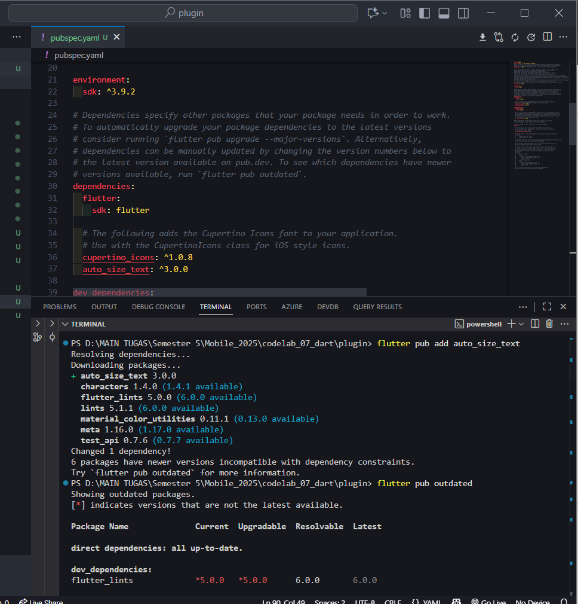
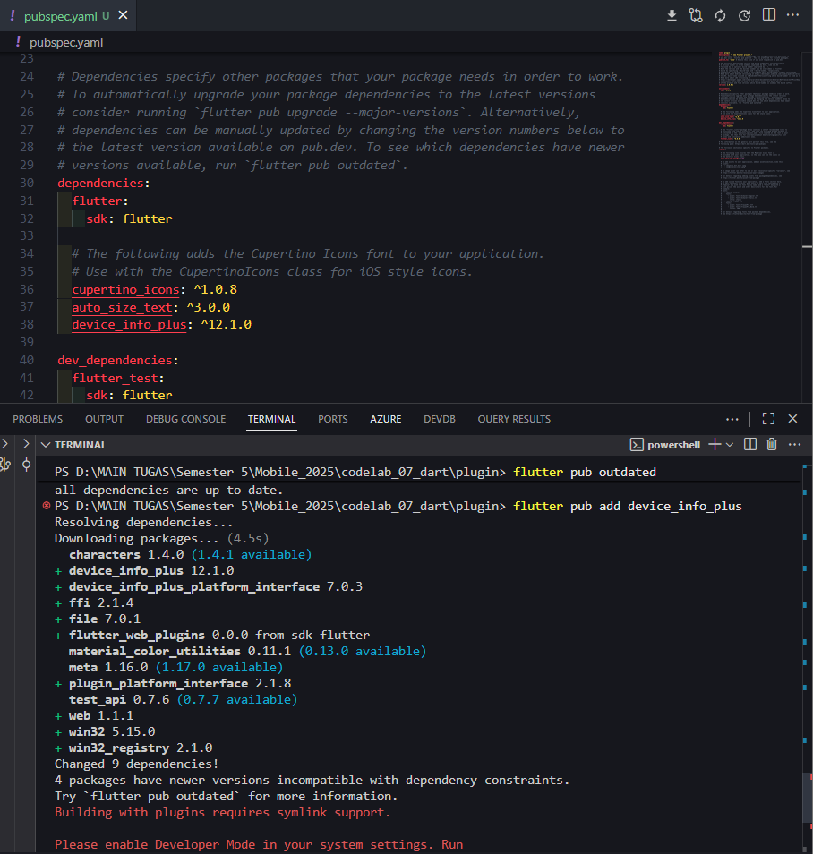
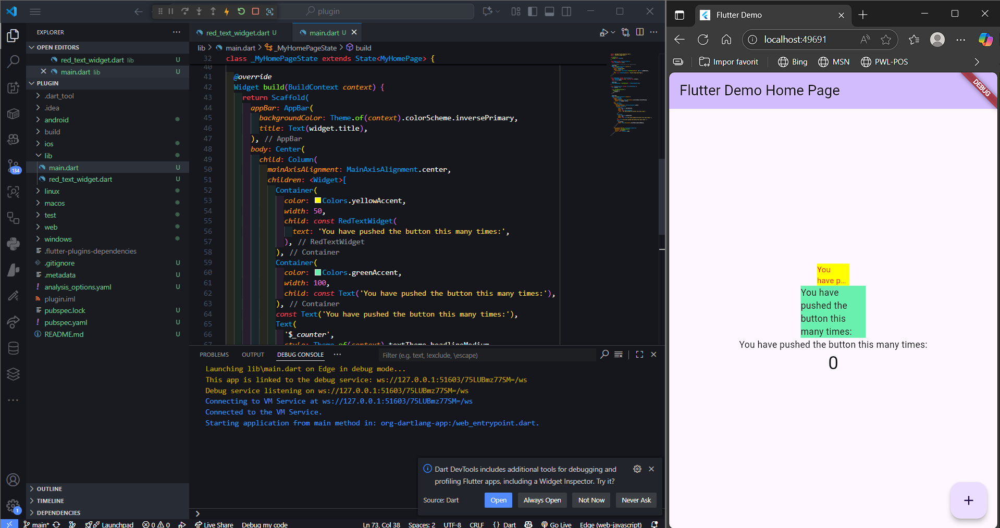

# 
LAPORAN PRAKTIKUM PEMROGRAMAN MOBILE

 

    

 

<table align="center">
    <tr>
        <td><strong>Nama</strong></td>
        <td>: Muhammad Irsyad Dimas Abdillah</td>
    </tr>
    <tr>
        <td><strong>Absen</strong></td>
        <td>: 20</td>
    </tr>
    <tr>
        <td><strong>NIM</strong></td>
        <td>: 2341720088</td>
    </tr>
    <tr>
        <td><strong>Prodi</strong></td>
        <td>: TEKNIK INFORMATIKA</td>
    </tr>
    <tr>
        <td><strong>Kelas</strong></td>
        <td>: 3H</td>
    </tr>
</table>

---
## Praktikum: Menerapkan Plugin di Project Flutter

### 1. Import Plugin `auto_size_text`

### 2. Import Plugin `device_info_plus`

### 3. Implementasi `auto_size_text`

---

## Tugas Praktikum

1. **Selesaikan Praktikum**  
    Dokumentasikan dan push ke repository Anda berupa screenshot hasil pekerjaan beserta penjelasannya di file `README.md`.

2. **Jelaskan maksud dari langkah 2 pada praktikum tersebut!**  
    **Jawab:**  
    Pada langkah 2, kita diminta untuk mengimpor plugin `auto_size_text` ke dalam proyek Flutter. Plugin ini berguna untuk mengatur ukuran teks secara otomatis agar sesuai dengan ruang yang tersedia, sehingga teks tetap terbaca dengan baik tanpa terpotong atau melampaui batas tampilan.

3. **Jelaskan maksud dari langkah 5 pada praktikum tersebut!**  
    **Jawab:**  
    Pada langkah 5, kita diminta untuk membuat variabel `text` dan parameter di constructor. Langkah ini untuk memperbaiki error di langkah 4 karena `text` belum didefinisikan. Dengan mendefinisikan variabel `text` dan parameter di constructor, kita dapat mengatur teks yang akan ditampilkan pada widget `AutoSizeText` sesuai kebutuhan aplikasi.

4. **Pada langkah 6 terdapat dua widget yang ditambahkan, jelaskan fungsi dan perbedaannya!**  
    **Jawab:**  
    Perbedaan antara dua widget tersebut adalah:  
    - Pada container pertama (dengan `yellowAccent`), widget `AutoSizeText` digunakan untuk menampilkan teks yang dapat menyesuaikan ukurannya secara otomatis agar sesuai dengan ruang yang tersedia.  
    - Pada container kedua (dengan `greenAccent`), widget `Text` digunakan untuk menampilkan teks dengan ukuran tetap yang tidak berubah sesuai ruang yang tersedia.  
    Jadi, `AutoSizeText` lebih fleksibel dalam menyesuaikan ukuran teks, sedangkan `Text` memiliki ukuran tetap.

5. **Jelaskan maksud dari tiap parameter yang ada di dalam plugin `auto_size_text` berdasarkan dokumentasi!**  
    **Jawab:**  
    - `text`: Menentukan teks yang akan ditampilkan oleh widget `AutoSizeText`.
    - `style`: Mengatur gaya teks, seperti ukuran font, warna, dan jenis font.
    - `maxLines`: Menentukan jumlah maksimum baris teks yang dapat ditampilkan. Jika teks melebihi jumlah baris ini, teks akan dipotong.
    - `overflow`: Menentukan bagaimana teks yang melebihi batas tampilan akan ditangani, seperti dengan menambahkan elipsis (...) di akhir teks.
    - `minFontSize`: Menentukan ukuran font minimum yang dapat digunakan oleh `AutoSizeText` saat menyesuaikan ukuran teks.
    - `maxFontSize`: Menentukan ukuran font maksimum yang dapat digunakan oleh `AutoSizeText` saat menyesuaikan ukuran teks.
    - `stepGranularity`: Menentukan langkah perubahan ukuran font saat menyesuaikan ukuran teks.
    - `presetFontSizes`: Menentukan daftar ukuran font yang dapat digunakan oleh `AutoSizeText` saat menyesuaikan ukuran teks.
    - `group`: Mengelompokkan beberapa widget `AutoSizeText` sehingga mereka dapat menyesuaikan ukuran teks secara bersamaan.
    - `textAlign`: Menentukan perataan teks, seperti kiri, tengah, atau kanan.
    - `softWrap`: Menentukan apakah teks dapat membungkus ke baris berikutnya jika melebihi lebar tampilan.
    - `wrapWords`: Menentukan apakah kata-kata dalam teks dapat dibungkus ke baris berikutnya.