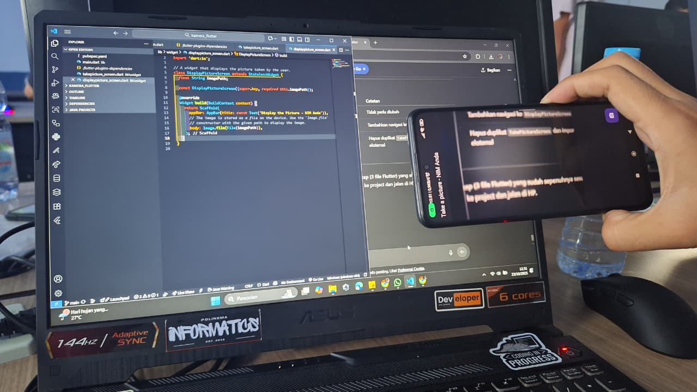

# 
LAPORAN PRAKTIKUM PEMROGRAMAN MOBILE

 

    

 

<table align="center">
    <tr>
        <td><strong>Nama</strong></td>
        <td>: Muhammad Irsyad Dimas Abdillah</td>
    </tr>
    <tr>
        <td><strong>Absen</strong></td>
        <td>: 20</td>
    </tr>
    <tr>
        <td><strong>NIM</strong></td>
        <td>: 2341720088</td>
    </tr>
    <tr>
        <td><strong>Prodi</strong></td>
        <td>: TEKNIK INFORMATIKA</td>
    </tr>
    <tr>
        <td><strong>Kelas</strong></td>
        <td>: 3H</td>
    </tr>
</table>

---

## Praktikum 1: Mengambil Foto dengan Kamera di Flutter

Hasil Build Apk:

## Praktikum 2: Membuat photo filter carousel

Output:

## TUGAS

2. Gabungkan hasil praktikum 1 dengan hasil praktikum 2 sehingga setelah melakukan pengambilan foto, dapat dibuat filter carouselnya!  

3. Jelaskan maksud void async pada praktikum 1? 
jawab: void async pada main praktikum 1 berfungsi agar bisa menjalankan proses lain yang butuh waktu lebih lama (memerlukan buka kamera) tanpa menutupi atau menghambat proses lain yang sedang berjalan. Ini memungkinkan pakai await agar proses selesai dulu sebelum lanjut ke langkah berikutnya.

4. Jelaskan fungsi dari anotasi @immutable dan @override ? 
jawab: 
    a. @immutable: Menandakan bahwa sebuah class tidak boleh diubah setelah dibuat. Semua properti dalam class tersebut harus final. Digunakan untuk menjaga konsistensi data dan mencegah perubahan tak disengaja.
    b. @override: Digunakan saat kita ingin menimpa (mengubah) method atau properti dari superclass. Ini memberi tahu compiler bahwa kita sengaja mengganti implementasi bawaan.

