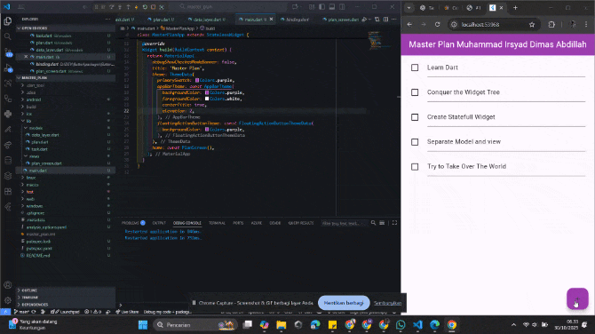
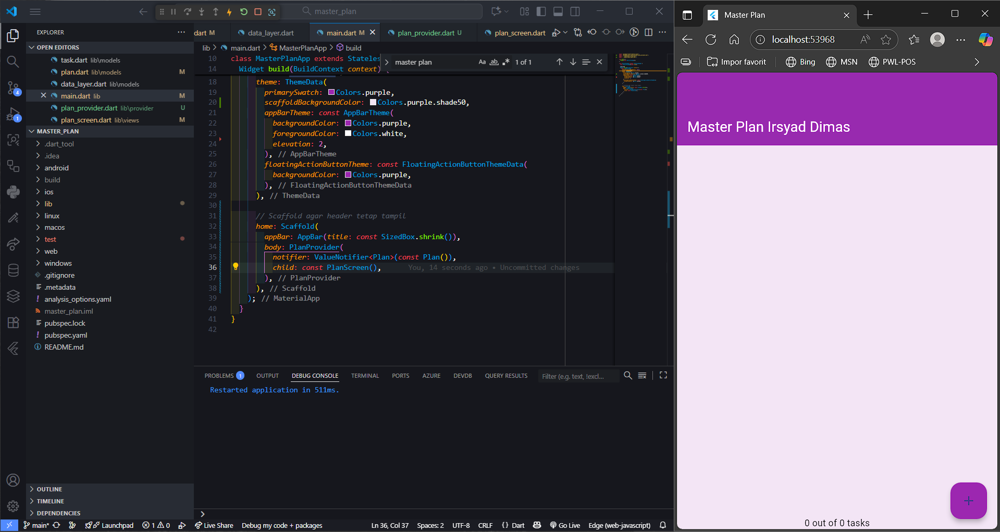
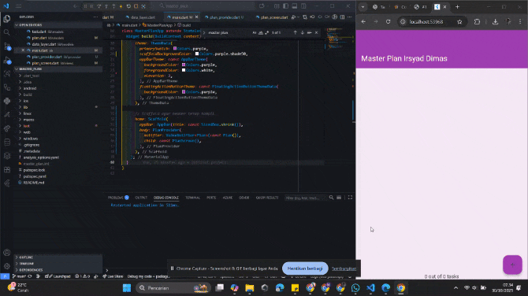

# 
LAPORAN PRAKTIKUM PEMROGRAMAN MOBILE

 

    

 

<table align="center">
    <tr>
        <td><strong>Nama</strong></td>
        <td>: Muhammad Irsyad Dimas Abdillah</td>
    </tr>
    <tr>
        <td><strong>Absen</strong></td>
        <td>: 20</td>
    </tr>
    <tr>
        <td><strong>NIM</strong></td>
        <td>: 2341720088</td>
    </tr>
    <tr>
        <td><strong>Prodi</strong></td>
        <td>: TEKNIK INFORMATIKA</td>
    </tr>
    <tr>
        <td><strong>Kelas</strong></td>
        <td>: 3H</td>
    </tr>
</table>

---

## Praktikum 1: Dasar State dengan Model-View
Hasil Build Apk:

## TUGAS PRAKTIKUM 1: Dasar State dengan Model-View
1. Selesaikan langkah-langkah praktikum tersebut, lalu dokumentasikan berupa GIF hasil akhir praktikum beserta penjelasannya di file README.md! Jika Anda menemukan ada yang error atau tidak berjalan dengan baik, silakan diperbaiki.

2. Jelaskan maksud dari langkah 4 pada praktikum tersebut! Mengapa dilakukan demikian?  
    jawab: Pada langkah 4 dibuat data layer yang mengekspor plan.dart dan task.dart. Tujuannya agar file lain cukup mengimpor data.dart untuk mengakses kelas Plan dan Task tanpa mengimpor kedua berkas secara terpisah. Pendekatan ini menyederhanakan pengelolaan kode dengan menyediakan satu titik akses (barrel file) sehingga impor menjadi lebih ringkas, rapi, dan konsisten.

3. Mengapa perlu variabel plan di langkah 6 pada praktikum tersebut? Mengapa dibuat konstanta ?  
    jawab: Variabel plan pada langkah 6 adalah objek dari kelas Plan yang menyimpan daftar tugas dalam aplikasi. Dengan menjadikannya const, objek tersebut tidak bisa diubah setelah dibuat. Hal ini menjaga data tetap aman dari perubahan yang tidak disengaja dan membuat aplikasi lebih efisien karena konstanta dioptimalkan oleh compiler.

4. Lakukan capture hasil dari Langkah 9 berupa GIF, kemudian jelaskan apa yang telah Anda buat!  
    jawab: pada langkah 9 kita berhasil membuat UI dinamis untuk daftar tugas yang bisa diubah secara langsung oleh pengguna melalui checkbox dan input teks.

5. Apa kegunaan method pada Langkah 11 dan 13 dalam lifecyle state ?  
    jawab: method pada langkah 11 yaitu scroll listener digunakan untuk mendeteksi perubahan posisi scroll pada daftar tugas. Hal ini memungkinkan aplikasi merespons interaksi pengguna dengan memperbarui UI sesuai kebutuhan. Sedangkan pada langkah 13, method dispose digunakan untuk membersihkan sumber daya yang tidak lagi diperlukan ketika widget dihapus dari pohon widget. Ini penting untuk mencegah kebocoran memori dan memastikan aplikasi berjalan efisien.

6. Kumpulkan laporan praktikum Anda berupa link commit atau repository GitHub ke dosen yang telah disepakati !

## Praktikum 2: Mengelola Data Layer dengan InheritedWidget dan InheritedNotifier
Hasil Build Apk:

## TUGAS PRAKTIKUM 2: InheritedWidget
Selesaikan langkah-langkah praktikum, dokumentasikan hasil akhir berupa GIF beserta penjelasan di file README.md. Jika menemukan error atau perilaku yang tidak sesuai tujuan aplikasi, perbaiki lalu catat perubahan yang dilakukan.

1. Jelaskan mana yang dimaksud InheritedWidget pada langkah 1. Mengapa digunakan InheritedNotifier?  
    Jawab: PlanProvider pada langkah 1 adalah subclass dari InheritedNotifier. InheritedWidget dipakai agar data (Plan) bisa diakses oleh seluruh widget turunan tanpa harus mengoper parameter manual. Dipilih InheritedNotifier karena kita ingin data (Plan) bisa berubah dinamis, dan setiap perubahan otomatis memberi tahu (notify) widget-widget yang bergantung padanya untuk rebuild.

2. Jelaskan maksud dari method di langkah 3 pada praktikum tersebut. Mengapa dilakukan demikian?  
    Jawab:  method completedCount digunakan untuk menghitung jumlah task yang sudah selesai, sedangkan completenessMessage membuat teks ringkas seperti “2 out of 5 tasks”. Tujuannya agar aplikasi bisa menampilkan progres penyelesaian tugas secara otomatis berdasarkan data task yang ada. Dengan begitu, pengguna langsung tahu sejauh mana rencana sudah dikerjakan.

3. Capture hasil dari Langkah 9 berupa GIF, kemudian jelaskan apa yang telah Anda buat.  
    jawab:
    
    
4. Kumpulkan laporan praktikum.  
    Cantumkan link commit atau repository GitHub (mis. URL ke commit atau repo) yang berisi kode, GIF, dan penjelasan lalu kirim ke dosen sesuai kesepakatan.
