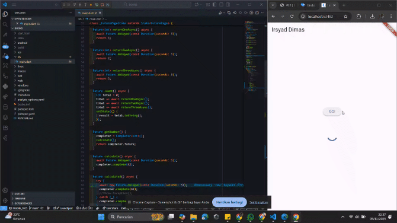
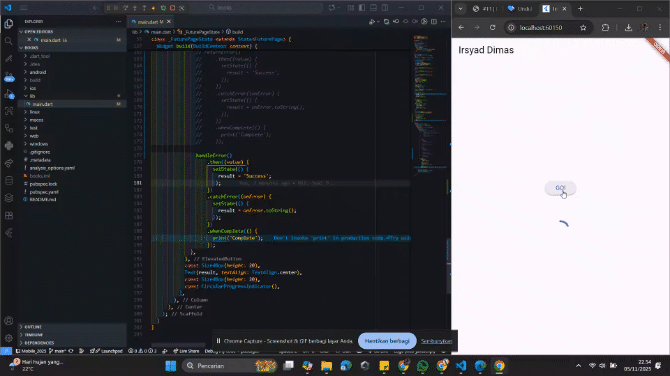
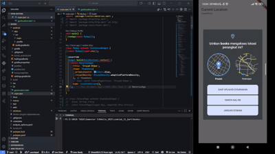
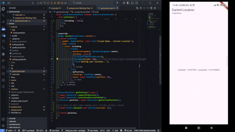

# 
LAPORAN PRAKTIKUM PEMROGRAMAN MOBILE

 

    

 

<table align="center">
    <tr>
        <td><strong>Nama</strong></td>
        <td>: Muhammad Irsyad Dimas Abdillah</td>
    </tr>
    <tr>
        <td><strong>Absen</strong></td>
        <td>: 20</td>
    </tr>
    <tr>
        <td><strong>NIM</strong></td>
        <td>: 2341720088</td>
    </tr>
    <tr>
        <td><strong>Prodi</strong></td>
        <td>: TEKNIK INFORMATIKA</td>
    </tr>
    <tr>
        <td><strong>Kelas</strong></td>
        <td>: 3H</td>
    </tr>
</table>

---

## Praktikum 1: Mengunduh Data dari Web Service (API)

### Soal 1–2
Nama dan hasil pemanggilan API bookstore (tampilkan screenshot hasil request):  

### Soal 3
Jelaskan maksud kode langkah 5 terkait `substring` dan `catchError`  
Jawaban: Saat tombol "GO!" ditekan aplikasi memanggil `fetchData()`. Jika request sukses, response body (`value.body`) diubah menjadi string lalu dipotong menjadi 450 karakter pertama dengan `substring(0, 450)` agar tampilan ringkas dan tidak memenuhi UI. Jika terjadi error (mis. koneksi gagal), blok `catchError` menangkap error tersebut dan menampilkan pesan fallback seperti "An error occurred" sehingga aplikasi tidak crash dan tetap responsif.

GIF hasil running aplikasi:  
.gif)

---

## Praktikum 2: Menggunakan await/async untuk menghindari callbacks

### Soal 4
Jelaskan maksud kode langkah 1 dan 2  
Jawaban:
- Langkah 1: Membuat metode async `returnOneAsync()`, `returnTwoAsync()`, `returnThreeAsync()` yang mensimulasikan operasi asynchronous dengan `Future.delayed` (mis. 3 detik) kemudian mengembalikan nilai integer (1, 2, 3).
- Langkah 2: 
    - `sumAsync()` memanggil ketiga metode di atas satu per satu menggunakan `await`, menunggu hasil masing‑masing, lalu menjumlahkannya dan mengembalikan total sebagai `Future<int>`.
    - Alternatifnya dibuat metode `count()` yang memanggil ketiga Future secara bersamaan menggunakan `Future.wait(...)`, menunggu semua selesai, lalu menjumlahkan daftar hasilnya. Ini lebih efisien jika operasi tidak bergantung satu sama lain.

GIF hasil running aplikasi:  

---

## Praktikum 3: Menggunakan Completer di Future

### Soal 5
Jelaskan maksud kode langkah 2  
Jawaban: Pada langkah ini dibuat dua fungsi utama: `futureGetNumber()` dan `calculate()`. `futureGetNumber()` membuat sebuah `Completer` dan mengembalikan `completer.future`. Fungsi `calculate()` menunggu selama beberapa detik (mis. 5 detik) lalu memanggil `completer.complete(42)` untuk menyelesaikan Future dengan nilai 42. Pola ini memberi kontrol manual kapan sebuah Future dianggap selesai, berguna untuk mensimulasikan atau mengendalikan alur asynchronous.

GIF hasil running aplikasi:  

### Soal 6
Jelaskan perbedaan kode langkah 2 dengan langkah 5–6  
Jawaban: Langkah 2 memperlihatkan pembuatan Future yang diselesaikan secara manual menggunakan `Completer`, sedangkan langkah 5–6 mengimplementasikan cara mengambil nilai asynchronous tersebut dan menampilkannya di UI atau menangani error. Intinya:
- Langkah 2 → fokus pada pembuatan dan penyelesaian Future (kontrol manual).
- Langkah 5–6 → fokus pada konsumsi hasil Future (display UI, penanganan error, integrasi ke alur aplikasi).

GIF hasil running aplikasi:  

---

## Praktikum 4: Menggunakan Stream untuk Mengelola Data Asynchronous

### Soal 7
Capture hasil praktikum berupa GIF dan lakukan commit dengan pesan "W11: Soal 7".  
Jawaban: GIF hasil running aplikasi:  

### Soal 8
Jelaskan perbedaan kode langkah 1 dan 4  
Jawaban:  
- Langkah 1: Membuat unit async sederhana (`returnOneAsync`, `returnTwoAsync`, `returnThreeAsync`) untuk mensimulasikan proses asynchronous terpisah, masing‑masing menunggu beberapa detik lalu mengembalikan angka.
- Langkah 4: Mengganti atau menggabungkan pemanggilan menggunakan `Future.wait(...)` (atau alternatif seperti `FutureGroup`) sehingga beberapa Future dijalankan bersamaan dan hasilnya diproses setelah semuanya selesai. Perbedaan utama: langkah 1 fokus pada pembuatan task async tunggal, langkah 4 fokus pada pengelolaan dan sinkronisasi banyak task sekaligus.

---

## Praktikum 5: Menangani Respon Error pada Async Code
### Soal 9
Hasil running aplikasi:

### Soal 10
Panggil method handleError() tersebut di ElevatedButton, lalu run. Apa hasilnya? Jelaskan perbedaan kode langkah 1 dan 4!  
Jawaban: Ketika tombol GO! ditekan, jika proses berhasil maka muncul tulisan “Success”.
Kalau terjadi error, pesan error seperti “An error occurred” akan tampil, dan setelah itu “Complete” tetap dicetak di console.
Artinya, aplikasi tetap aman dan selalu menandai proses sudah selesai.

Perbedaan Langkah 1 dan Langkah 4:
-Langkah 1 menjalankan beberapa tugas async satu per satu.
-Langkah 4 menggunakan Future.wait agar semua tugas dijalankan bersamaan dan hasilnya diterima sekaligus. 

GIF hasil running aplikasi:

---

## Praktikum 6: Menggunakan Future dengan StatefulWidget

### Soal 11
Tambahkan nama panggilan Anda pada tiap properti title sebagai identitas pekerjaan Anda.
Jawaban: 

### Soal 12
Jika Anda tidak melihat animasi loading tampil, kemungkinan itu berjalan sangat cepat. Tambahkan delay pada method getPosition() dengan kode await Future.delayed(const Duration(seconds: 3)); 
jawaban: 
GIF hasil running aplikasi:

GIF setelah diberikan delay:

Apakah Anda mendapatkan koordinat GPS ketika run di browser? Mengapa demikian?
jawaban: Tidak, karena browser tidak mengizinkan akses GPS secara langsung. Akses GPS biasanya memerlukan izin khusus yang hanya dapat diberikan pada aplikasi mobile atau melalui protokol HTTPS di browser.

