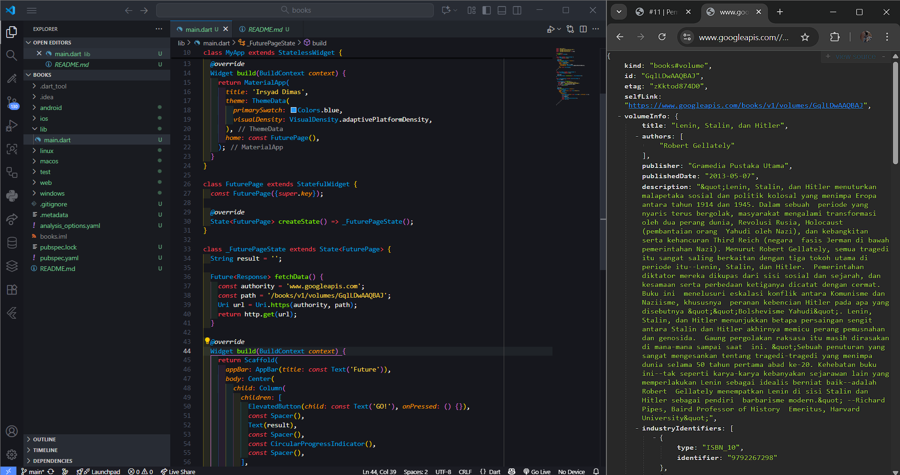
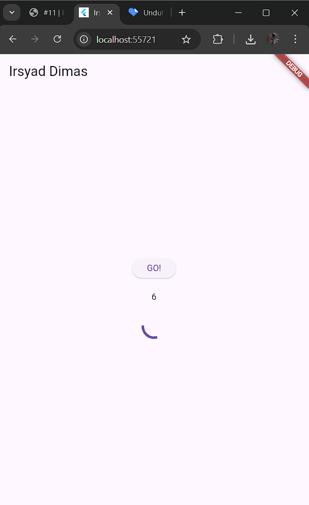

# 
LAPORAN PRAKTIKUM PEMROGRAMAN MOBILE

 

    

 

<table align="center">
    <tr>
        <td><strong>Nama</strong></td>
        <td>: Muhammad Irsyad Dimas Abdillah</td>
    </tr>
    <tr>
        <td><strong>Absen</strong></td>
        <td>: 20</td>
    </tr>
    <tr>
        <td><strong>NIM</strong></td>
        <td>: 2341720088</td>
    </tr>
    <tr>
        <td><strong>Prodi</strong></td>
        <td>: TEKNIK INFORMATIKA</td>
    </tr>
    <tr>
        <td><strong>Kelas</strong></td>
        <td>: 3H</td>
    </tr>
</table>

---

## Praktikum 1: Mengunduh Data dari Web Service (API)

### Soal 1-2 
Nama dan Hasil API bookstore yang diakses dari URL:

### Soal 3
- Jelaskan maksud kode langkah 5 tersebut terkait substring dan catchError!  
jawab: Saat tombol GO! ditekan, aplikasi memanggil fetchData() untuk mengambil data dari API. Jika berhasil, isi respons (value.body) diubah menjadi string dan dipotong hanya 450 karakter pertama menggunakan substring(0, 450) agar tampilannya ringkas dan tidak overload di UI. Jika terjadi error (misalnya koneksi gagal), blok catchError akan menampilkan pesan fallback: "An error occurred" ke layar, menjaga agar aplikasi tetap responsif dan tidak crash.

GIF hasil running aplikasi:

## Praktikum 2: Menggunakan await/async untuk menghindari callbacks

### Soal 4 
- Jelaskan maksud kode langkah 1 dan 2 tersebut!  
jawab: langkah 1 adalah membuat metode returnOneAsync() hingga three, dimana ketiganya melakukan simulasi proses asynchronous dengan menunggu selama 3 detik menggunakan Future.delayed sebelum mengembalikan nilai integer (1, 2, atau 3). Langkah 2 adalah membuat metode sumAsync() yang memanggil ketiga metode sebelumnya secara berurutan menggunakan await untuk menunggu hasilnya. Setelah mendapatkan ketiga nilai, sumAsync() menjumlahkannya dan mengembalikan totalnya sebagai Future<int>. Sedangkan langkah kedua yaitu membuat metode count() yang memanggil ketiga metode returnOneAsync() hingga three secara bersamaan menggunakan Future.wait. Metode ini menunggu hingga semua Future selesai dan mengembalikan daftar hasilnya. Kemudian, count() menjumlahkan semua nilai dalam daftar tersebut dan mengembalikan totalnya sebagai Future<int>.

GIF hasil running aplikasi:

## Praktikum 3: Menggunakan Completer di Future

### Soal 5
- Jelaskan maksud kode langkah 2 tersebut!  
jawab: Pada langkah 2, dibuat dua metode: futureGetNumber dan calculate.
Saat getNumber() dijalankan, aplikasi membuat Completer, lalu calculate() menunggu 5 detik sebelum memberikan nilai 42. Nilai ini dikembalikan sebagai Future.
Cara ini memungkinkan kita mengatur sendiri kapan Future selesai, misalnya untuk meniru proses yang butuh waktu lama.

GIF hasil running aplikasi:

### Soal 6
- Jelaskan maksud perbedaan kode langkah 2 dengan langkah 5-6 tersebut!  
jawab: langkah 5 dan 6 bertujuan untuk membuat sebuah metode untuk mengambil nilai secara asynchronous dengan kontrol manual, lalu menampilkan hasilnya ke UI atau menangani error jika gagal.

GIF hasil running aplikasi:

## Praktikum 4: Menggunakan Stream untuk Mengelola Data Asynchronous