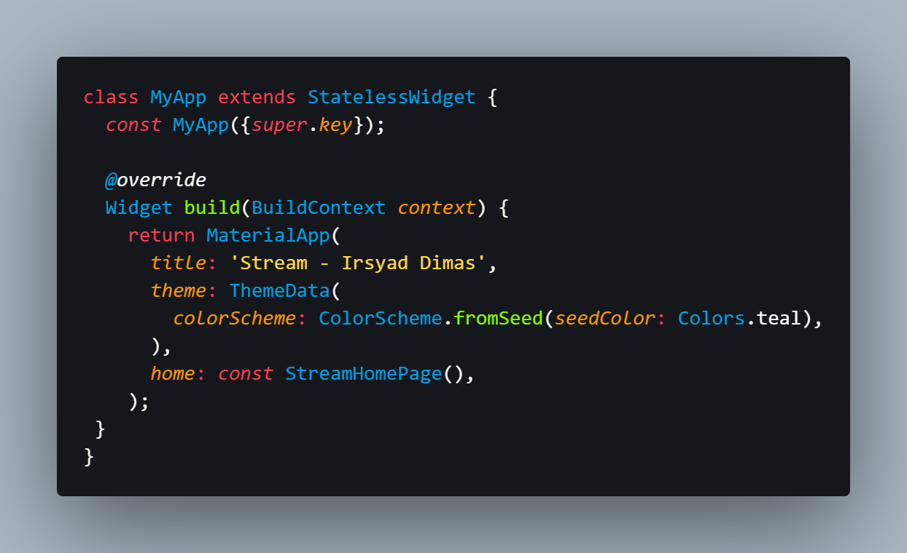
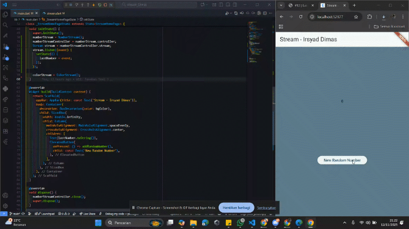
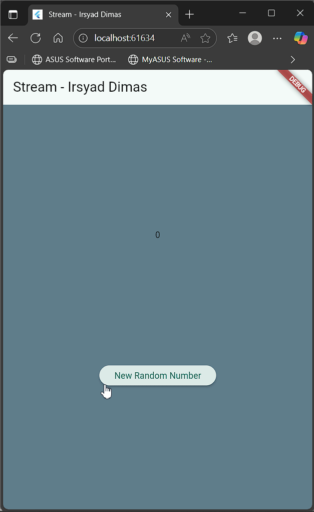
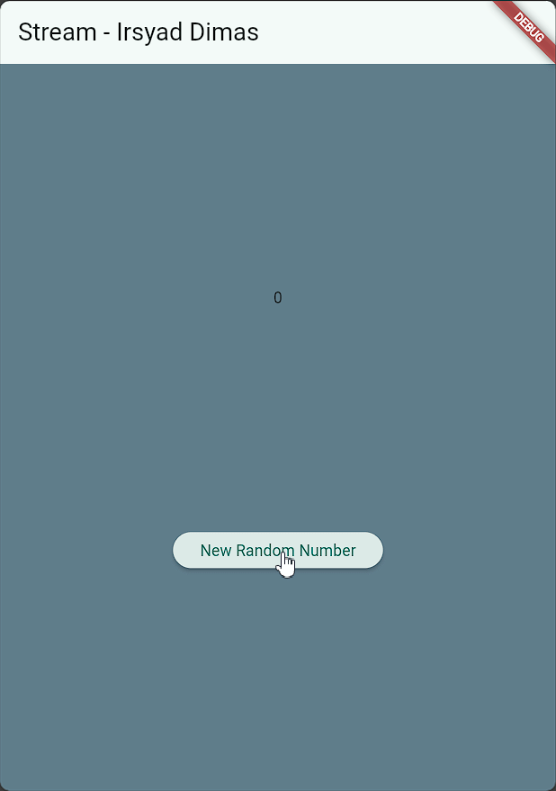
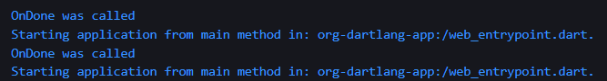
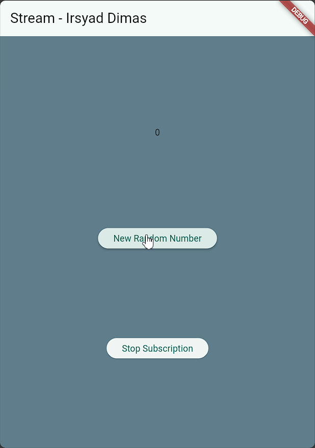

# <p align="center">LAPORAN PRAKTIKUM PEMROGRAMAN MOBILE</p>

<br>

<p align="center">
    
</p>

<br>

<table align="center">
    <tr>
        <td><strong>Nama</strong></td>
        <td>: Muhammad Irsyad Dimas Abdillah</td>
    </tr>
    <tr>
        <td><strong>Absen</strong></td>
        <td>: 20</td>
    </tr>
    <tr>
        <td><strong>NIM</strong></td>
        <td>: 2341720088</td>
    </tr>
    <tr>
        <td><strong>Prodi</strong></td>
        <td>: TEKNIK INFORMATIKA</td>
    </tr>
    <tr>
        <td><strong>Kelas</strong></td>
        <td>: 3H</td>
    </tr>
</table>

---

## Praktikum 1: Dart Streams

### Soal 1
Tambahkan nama panggilan Anda pada judul aplikasi sebagai identitas hasil pekerjaan Anda.  
Ganti warna tema aplikasi menjadi warna kesukaan Anda.  
**Jawaban:**  


### Soal 2
Tambahkan 5 warna lainnya sesuai keinginan Anda pada variabel `colors`.  
**Jawaban:**  


### Soal 3
**Jelaskan fungsi keyword `yield*` pada kode tersebut!**  
`yield*` digunakan untuk mengalirkan seluruh data dari stream lain ke stream utama, yaitu `getColors()`.

**Apa maksud isi perintah kode tersebut?**  
Perintah tersebut membuat sebuah stream yang menghasilkan warna secara periodik setiap satu detik. Setiap kali timer berjalan, warna diambil dari daftar `colors` berdasarkan indeks yang dihitung dengan operasi modulo terhadap jumlah warna dalam daftar.

### Soal 4
Capture hasil praktikum Anda berupa GIF dan lampirkan di README.  


### Soal 5
**Jelaskan perbedaan menggunakan `listen` dan `await for` (langkah 9)!**  
`await for` membaca stream secara berurutan dan menunggu hingga selesai, sedangkan `listen` menjalankan callback setiap data baru muncul tanpa menunggu stream berakhir.


## Praktikum 2: Stream controllers dan sinks
### Soal 6
Jelaskan maksud kode langkah 8 dan 10 tersebut!
jawaban:
Langkah 8 menghubungkan stream ke UI sehingga setiap perubahan data pada stream langsung ditampilkan di aplikasi tanpa perlu refresh manual. Dengan begitu, angka terbaru yang dihasilkan akan otomatis muncul pada tampilan UI.

Langkah 10 berfungsi untuk menghasilkan angka acak menggunakan fungsi tertentu, lalu angka tersebut dikirimkan ke stream melalui sink. Setiap kali angka baru dikirim, stream akan memberitahu UI untuk memperbarui tampilan dengan angka terbaru secara otomatis. Proses ini membuat aplikasi responsif terhadap perubahan data secara real-time.

Hasil run GIF:


### Soal 7
Jelaskan maksud kode langkah 13 sampai 15 tersebut!
jawaban:
Langkah 13: Menambahkan method addError() pada NumberStream untuk memasukkan error ke dalam stream sink.

Langkah 14: Menambahkan parameter onError di method listen() agar aplikasi dapat menangani error yang diterima Stream, misalnya dengan menampilkan nilai 0.

Langkah 15: Mengubah fungsi addRandomNumber() agar memanggil addError()—bukan menambah angka acak—sehingga proses error pada Stream dapat diuji secara langsung.

Kembalikan kode seperti semula pada Langkah 15, comment addError() agar Anda dapat melanjutkan ke praktikum 3 berikutnya.
jawaban:
```dart
  void addRandomNumber() {
    Random random = Random();
    int myNum = random.nextInt(10);
    numberStream.addNumberToSink(myNum);

    // numberStream.addError();
  }
```

Hasil run GIF:


## Praktikum 3: Injeksi data ke streams

### Soal 8
Jelaskan maksud kode langkah 1-3 tersebut!
Jawaban: 
Langkah 1 melakukan inisialisasi variable late transformer yang bertipe StreamTransformer. Variable ini akan digunakan untuk mentransformasi data yang masuk ke dalam stream.
Langkah 2 (transformer): Stream diberi transformer untuk memproses data sebelum masuk ke listener. Misalnya, setiap angka dikalikan 10, atau jika ada error langsung diganti dengan nilai tertentu.
Langkah 3 (listen + onError): Stream yang sudah ditransformasi kemudian di-listen. Event normal akan mengubah lastNumber sesuai data, sedangkan error ditangani lewat onError dengan menetapkan nilai fallback (misalnya -1).

Hasil run GIF:


## Praktikum 4: Subscribe ke stream events

### Soal 9
Jelaskan maksud kode langkah 2, 6 dan 8 tersebut!
Jawaban:
Langkah 2: Kode tersebut membuat subscription ke stream agar setiap data baru yang masuk langsung diperbarui ke variabel lastNumber melalui setState. Dengan begitu, UI otomatis mengikuti perubahan nilai dari stream.
Langkah 6: Kode ini membatalkan subscription ke stream. Setelah dipanggil, aplikasi tidak akan lagi menerima pembaruan data dari stream, sehingga nilai lastNumber tidak akan berubah lagi.
Langkah 8: kode ini menjaga agar penambahan data ke stream tidak dilakukan saat controller sudah ditutup, sehingga lebih aman dan terkontrol.


Output Debug Console:


Hasil run GIF:

