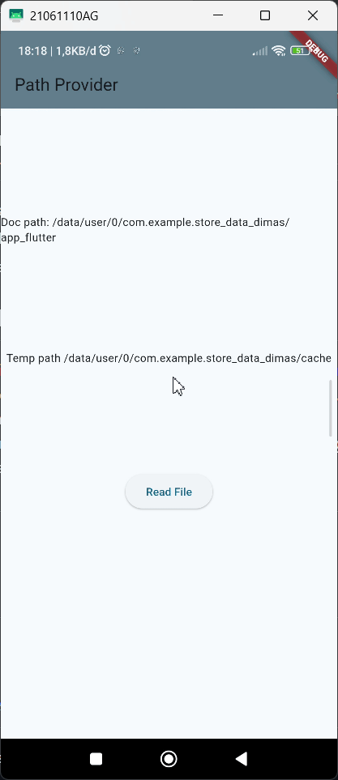
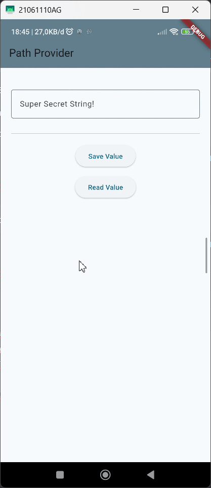

# <p align="center">LAPORAN PRAKTIKUM PEMROGRAMAN MOBILE</p>

<br>

<p align="center">
    
</p>

<br>

<table align="center">
    <tr>
        <td><strong>Nama</strong></td>
        <td>: Muhammad Irsyad Dimas Abdillah</td>
    </tr>
    <tr>
        <td><strong>Absen</strong></td>
        <td>: 20</td>
    </tr>
    <tr>
        <td><strong>NIM</strong></td>
        <td>: 2341720088</td>
    </tr>
    <tr>
        <td><strong>Prodi</strong></td>
        <td>: TEKNIK INFORMATIKA</td>
    </tr>
    <tr>
        <td><strong>Kelas</strong></td>
        <td>: 3H</td>
    </tr>
</table>

---

## Praktikum 1: Konversi Dart model ke JSON

### Soal 1

**Pertanyaan:** Tambahkan nama panggilan Anda pada title app sebagai identitas hasil pekerjaan Anda dan gantilah warna tema aplikasi sesuai kesukaan Anda.

**Jawaban:**

Menambahkan nama panggilan pada title aplikasi:

```dart
// This widget is the root of your application.
@override
Widget build(BuildContext context) {
  return MaterialApp(
    title: 'Irsyad Dimas - Flutter JSON Demo',
    theme: ThemeData(primarySwatch: Colors.blue),
    home: const MyHomePage(),
  );
}
```

Mengganti warna tema aplikasi:

```dart
class MyApp extends StatelessWidget {
  const MyApp({super.key});

  // This widget is the root of your application.
  @override
  Widget build(BuildContext context) {
    return MaterialApp(
      title: 'Irsyad Dimas - Flutter JSON Demo',
      theme: ThemeData(
        colorScheme: ColorScheme.fromSeed(
          seedColor: Colors.blueGrey,
          brightness: Brightness.light,
        ),
        useMaterial3: true,
      ),
      home: const MyHomePage(),
    );
  }
}
```

### Soal 2

**Pertanyaan:** Masukkan hasil capture layar ke laporan praktikum Anda.

**Jawaban:**

<p align="center">
  
</p>

### Soal 3

**Pertanyaan:** Masukkan hasil capture layar ke laporan praktikum Anda.

**Jawaban:**

**Hasil Praktikum:**

<p align="center">
  
</p>

**Langkah 25:**

<p align="center">
  
</p>

---

## Praktikum 2: Handle kompatibilitas data JSON

### Langkah 9

<p align="center">
  
</p>

### Soal 4

**Pertanyaan:** Capture hasil running aplikasi Anda, kemudian impor ke laporan praktikum Anda!

**Jawaban:**

<p align="center">
  
</p>

---

## Praktikum 3: Menangani error JSON

### Soal 5

**Pertanyaan:** Jelaskan maksud kode lebih safe dan maintainable!

**Jawaban:**

Kode yang lebih **safe** dan **maintainable** berarti kode tersebut dirancang untuk mengurangi risiko kesalahan (error) selama eksekusi dan memudahkan pemeliharaan di masa depan. 

**Safe (Aman):**
Kode yang aman biasanya mencakup penanganan error yang baik, validasi input, dan penggunaan tipe data yang tepat untuk menghindari crash atau perilaku tak terduga.

**Maintainable (Mudah Dipelihara):**
Kode yang mudah dipelihara berarti kode tersebut ditulis dengan cara yang jelas, terstruktur, dan terdokumentasi dengan baik, sehingga memudahkan pengembang lain (atau diri sendiri di masa depan) untuk memahami, memperbaiki, atau mengembangkan kode tersebut tanpa kesulitan.

**Hasil capture layar aplikasi:**

<p align="center">
  
</p>

---

## Praktikum 4: SharedPreferences

**Keterangan:**
Di recording tidak terlihat karena hanya merekam bagian browser saja. Angka pada counter bertambah saat tombol restart app diklik, sedangkan jika refresh halaman, counter akan tetap menampilkan nilai terakhir sebelum di-refresh.

<p align="center">
  
</p>

### Soal 6

**Pertanyaan:** Capture hasil praktikum Anda berupa GIF dan lampirkan di README.

**Jawaban:**

```dart
@override
Widget build(BuildContext context) {
  return Scaffold(
    appBar: AppBar(
      title: const Text('Shared Preferences - Dimas'),
      backgroundColor: Colors.orange,
    ),
    body: Center(
      child: Column(
        mainAxisAlignment: MainAxisAlignment.center,
        children: [
          Text(
            'You have opened the app $appCounter times.',
            style: const TextStyle(fontSize: 18),
          ),
          const SizedBox(height: 20),
          ElevatedButton(
            onPressed: () {
              deletePreferece();
            },
            child: const Text('Reset counter'),
          ),
        ],
      ),
    ),
  );
}
```

**Hasil capture layar aplikasi:**

<p align="center">
  
</p>

---

## Praktikum 5: Akses filesystem dengan path_provider

### Soal 7

**Pertanyaan:** Capture hasil praktikum Anda dan lampirkan di README.

**Jawaban:**

<p align="center">
  
</p>

---

## Praktikum 6: Akses filesystem dengan direktori

### Soal 8

**Pertanyaan:** Jelaskan maksud kode pada langkah 3 dan 7!

**Jawaban:**

**Langkah 3 – Membuat Method writeFile()**

Membuat method asinkron bernama `writeFile()` untuk menulis data ke file menggunakan `myFile.writeAsString()`. Data awal berupa "Margherita, Capricciosa, Napoli" diganti dengan Nama Lengkap dan NIM agar file berisi identitas mahasiswa.

**Langkah 7 – Menjalankan dan Menguji Aplikasi**

Menjalankan aplikasi untuk memastikan proses penulisan dan pembacaan file berjalan dengan baik. Saat tombol "Read File" ditekan, aplikasi membaca isi file yang telah ditulis dan menampilkan Nama dan NIM di layar.

**Hasil capture layar aplikasi:**

<p align="center">
  
</p>

---

## Praktikum 7: Menyimpan data dengan enkripsi/dekripsi

### Soal 9

**Pertanyaan:** Capture hasil praktikum Anda berupa GIF dan lampirkan di README.

**Jawaban:**

<p align="center">
  
</p>

---