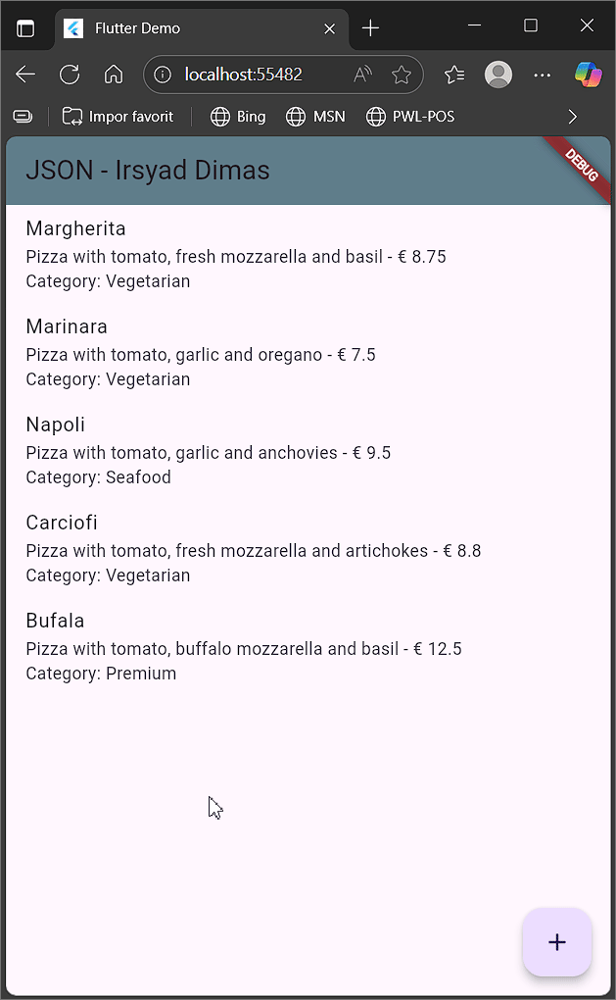

# LAPORAN PRAKTIKUM PEMROGRAMAN MOBILE

<br>

<p align="center">
    
</p>

<br>

<table align="center">
    <tr>
        <td><strong>Nama</strong></td>
        <td>: Muhammad Irsyad Dimas Abdillah</td>
    </tr>
    <tr>
        <td><strong>Absen</strong></td>
        <td>: 20</td>
    </tr>
    <tr>
        <td><strong>NIM</strong></td>
        <td>: 2341720088</td>
    </tr>
    <tr>
        <td><strong>Prodi</strong></td>
        <td>: TEKNIK INFORMATIKA</td>
    </tr>
    <tr>
        <td><strong>Kelas</strong></td>
        <td>: 3H</td>
    </tr>
</table>

---

## Praktikum 1: Membuat Layanan Mock API

### Soal 1

**Tugas:**
Tambahkan nama panggilan Anda pada title app sebagai identitas hasil pekerjaan Anda. Gantilah warna tema aplikasi sesuai kesukaan Anda.

**Jawaban:**

```dart
appBar: AppBar(
  title: const Text('JSON - Irsyad Dimas'),
  backgroundColor: Colors.blueGrey,
),
```

**Hasil Eksekusi Aplikasi:**


---

## Praktikum 2: Mengirim Data ke Web Service (POST)

### Soal 2

**Tugas:**
Tambahkan field baru dalam JSON maupun POST ke Wiremock.

**Jawaban:**

Field baru ditambahkan pada konfigurasi Wiremock dengan menambahkan field `category` pada body JSON.

**Konfigurasi Request Body:**

```json
{ 
  "id": 1, 
  "pizzaName": "Margherita", 
  "description": "Pizza with tomato, fresh mozzarella and basil",
  "price": 8.75, 
  "imageUrl": "images/margherita.png",
  "category": "Vegetarian"
}
```


**Konfigurasi Response Body:**

```json
{
  "message": "The pizza was posted",
  "status": "success"
}
```


**Hasil Eksekusi Aplikasi:**


---

## Praktikum 3: Memperbarui Data di Web Service (PUT)

### Soal 3

**Tugas:**
Ubah salah satu data dengan Nama dan NIM Anda, lalu perhatikan hasilnya di Wiremock.

**Jawaban:**


**Hasil di Wiremock:**


---

## Praktikum 4: Menghapus Data dari Web Service (DELETE)

### Soal 4

**Implementasi Kode:**

```dart
return ListView.builder(
  itemCount: pizzas.length,
  itemBuilder: (BuildContext context, int position) {
    final pizza = pizzas[position];
    return Dismissible(
      key: Key(position.toString()),
      onDismissed: (item) {
        HttpHelper helper = HttpHelper();
        setState(() {
          pizzas.removeAt(position);
        });
        helper.deletePizza(pizza.id!);
      },
      child: ListTile(
        title: Text(pizza.pizzaName ?? 'No Name'),
        subtitle: Text(
          '${pizza.description ?? 'No Description'} - € ${pizza.price ?? 0.0}\nCategory: ${pizza.category ?? 'No Category'}',
        ),
        onTap: () {
          Navigator.push(
            context,
            MaterialPageRoute(
              builder: (context) =>
                  PizzaDetailScreen(pizza: pizza, isNew: false),
            ),
          );
        },
      ),
    );
  },
);
```

**Hasil Eksekusi Aplikasi:**



**Analisis:**

Mengapa data yang sudah di-swipe dan dihapus muncul kembali setelah browser otomatis melakukan refresh? Hal ini terjadi karena WireMock tidak benar-benar menghapus data dari server, melainkan hanya menyembunyikannya pada response yang dikirimkan. Akibatnya, ketika aplikasi melakukan fetch ulang, data yang sebelumnya dihapus tetap tersimpan di server WireMock dan ditampilkan kembali di aplikasi.

---
