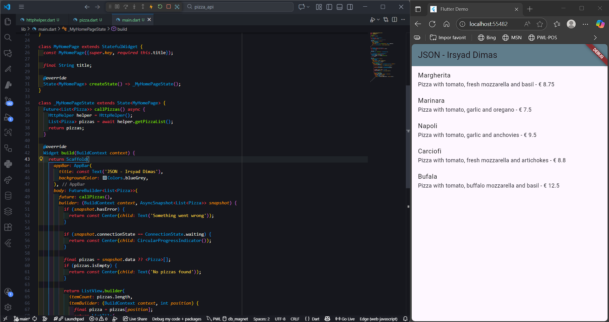
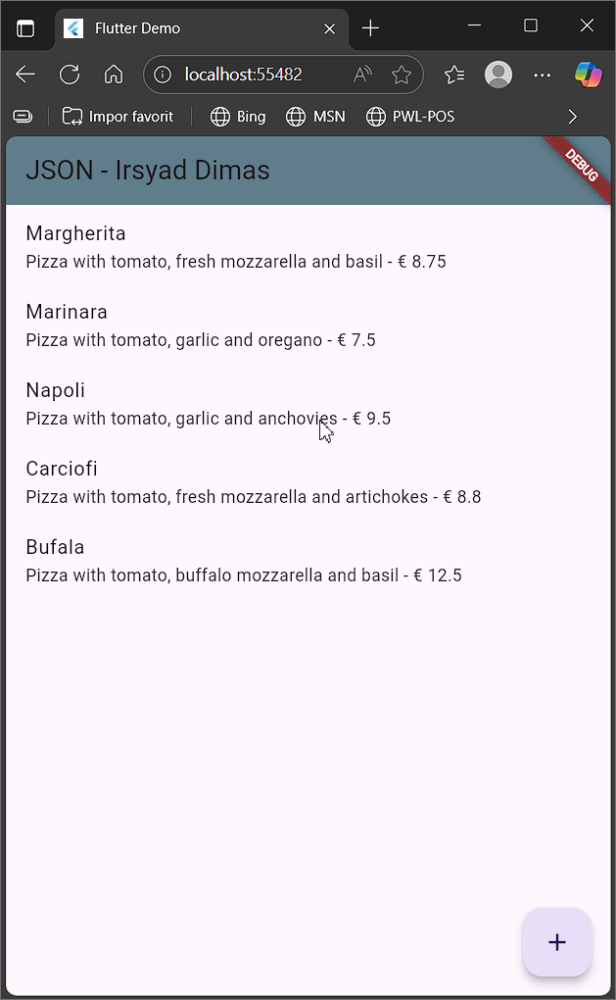
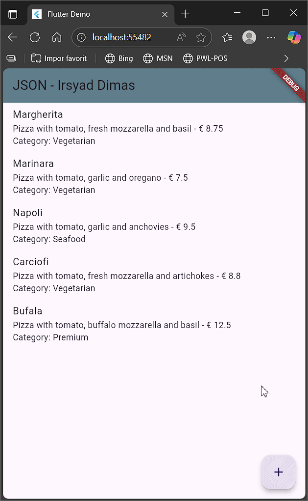
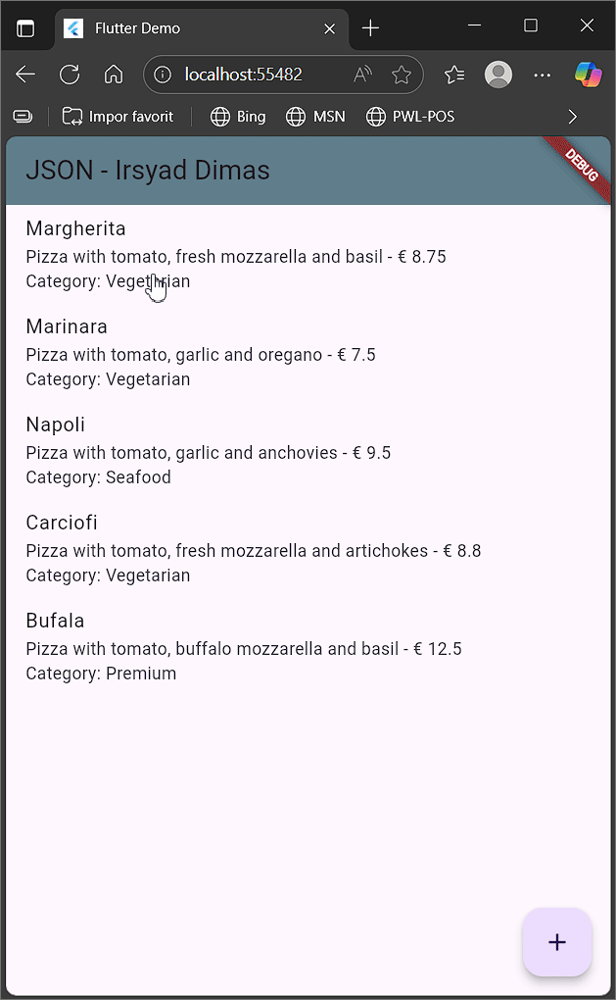

# <p align="center">LAPORAN PRAKTIKUM PEMROGRAMAN MOBILE</p>

<br>

<p align="center">
    
</p>

<br>

<table align="center">
    <tr>
        <td><strong>Nama</strong></td>
        <td>: Muhammad Irsyad Dimas Abdillah</td>
    </tr>
    <tr>
        <td><strong>Absen</strong></td>
        <td>: 20</td>
    </tr>
    <tr>
        <td><strong>NIM</strong></td>
        <td>: 2341720088</td>
    </tr>
    <tr>
        <td><strong>Prodi</strong></td>
        <td>: TEKNIK INFORMATIKA</td>
    </tr>
    <tr>
        <td><strong>Kelas</strong></td>
        <td>: 3H</td>
    </tr>
</table>

---

## Praktikum 1: Membuat layanan Mock API

### Soal 1

Tambahkan nama panggilan Anda pada title app sebagai identitas hasil pekerjaan Anda.
Gantilah warna tema aplikasi sesuai kesukaan Anda.
jawaban:

```dart
      appBar: AppBar(
        title: const Text('JSON - Irsyad Dimas'),
        backgroundColor: Colors.blueGrey,
      ),
```

Hasil Run App:


## Praktikum 2: Mengirim Data ke Web Service (POST)

### Soal 2

Hasil Run App:


Tambahkan field baru dalam JSON maupun POST ke Wiremock!
jawaban:

Field baru di Wiremock:
menambahkan field category pada body json

```json
  { 
    "id": 1, 
    "pizzaName": "Margherita", 
    "description": "Pizza with tomato, fresh mozzarella and basil",
    "price": 8.75, 
    "imageUrl": "images/margherita.png",
    "category": "Vegetarian"
  }
```


menambahkan response field pada response json

```json
{
  "message": "The pizza was posted",
  "status": "success"
}
```


Hasil Run App:


GIF:


## Praktikum 3: Memperbarui Data di Web Service (PUT)

### Soal 3

Ubah salah satu data dengan Nama dan NIM Anda, lalu perhatikan hasilnya di Wiremock.
jawaban:

